Arduino IDE User Guide
======================

Arduino IDE is a simple and easy-to-use open-source development environment that supports a variety of microcontrollers, including the ESP32. Here, you can unleash your creativity and write your own programs.

1. Install Arduino IDE
----------------------

A. Click here to visit the `Arduino IDE <https://www.arduino.cc/en/software/>`_ website and download the installation package suitable for your computer version. This example will demonstrate using Windows.

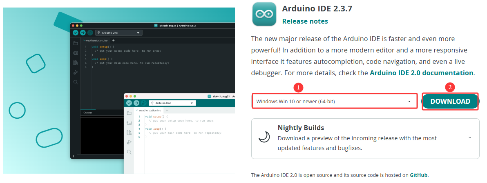

----
B. Run the installer by double-clicking the downloaded ``arduino-ide_xxxx.exe`` file.  

C. Read and accept the **License Agreement**.  

.. image:: _static/arduino/2.install.png
   :width: 800
   :align: center

----

D. Select the desired installation options.

.. image:: _static/arduino/3.install.png
   :width: 800
   :align: center

----

E. Choose the installation path. It is recommended to install the software on a non-system drive.

.. image:: _static/arduino/4.install.png
   :width: 800
   :align: center

----

F. Click Install and wait for the process to complete. Finally, click Finish.

.. image:: _static/arduino/5.install.png
   :width: 800
   :align: center

----

2. Add ESP32 Board Manager
--------------------------

A. Open the Arduino IDE, click **File** → **Preferences** in the upper left corner, and copy and paste the following address into the Additional Board Manager URLs input box.

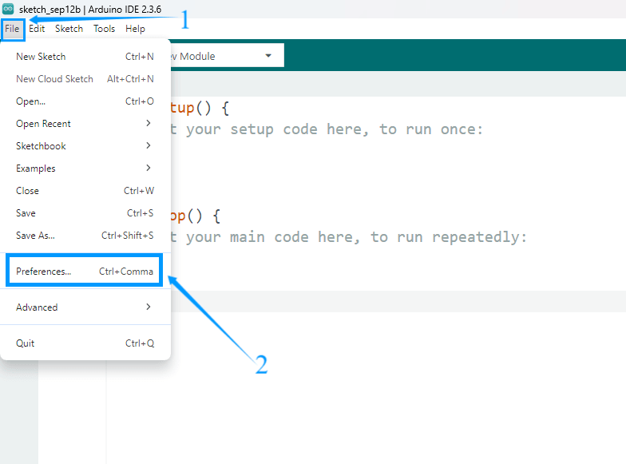
----

B. After entering the URL, click OK. **https://espressif.github.io/arduino-esp32/package_esp32_index.json**

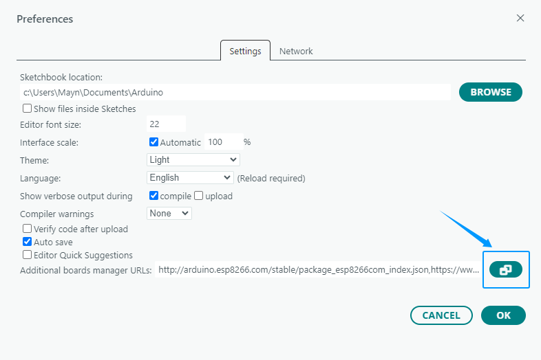

.. raw:: html

   

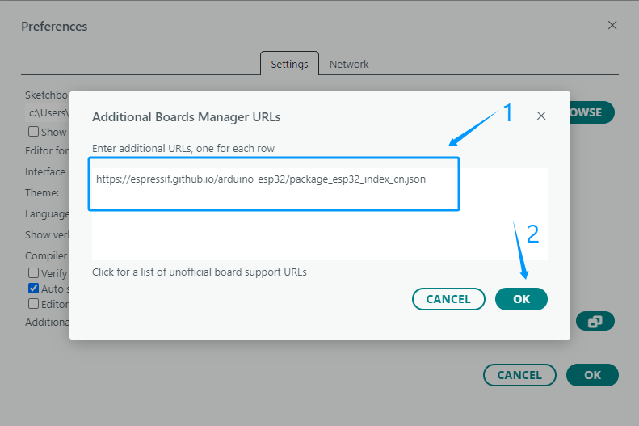
----

C. After completing this step, close and reopen the Arduino IDE.

----

3. Download  ESP32 Core Package
----------------------------

A. Click on the **BOARDS MANAGER** icon on the right and search for **"ESP32"**.

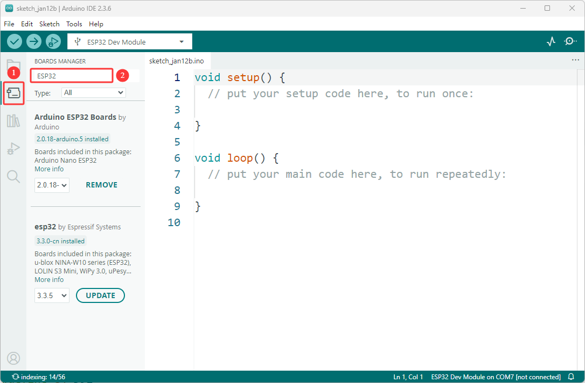

----

B. Find the core package named **esp32 by Espressif systems**, select version **2.0.12**, and click the **install** button to install it.

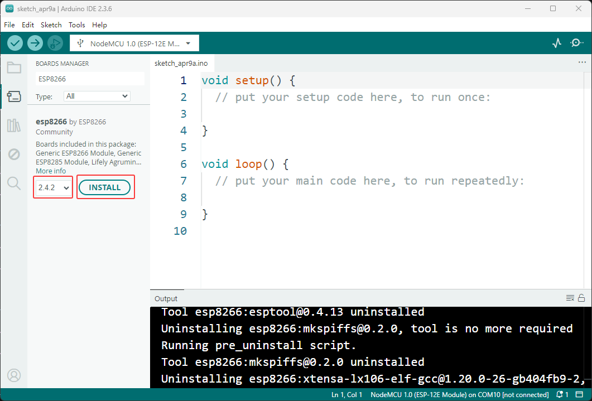
----

C. You can view the download progress in the OUTLOOK window.

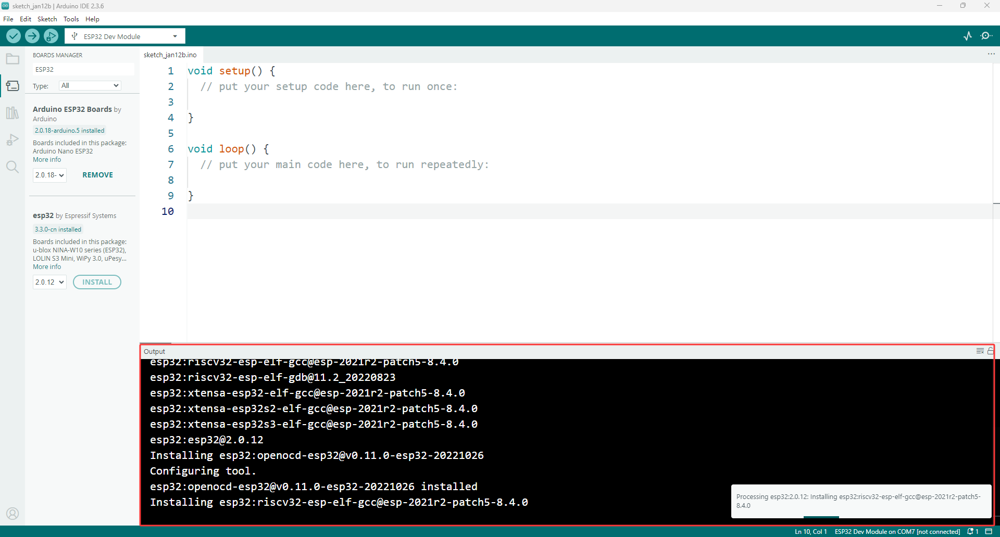

----

D. The prompt for successful installation indicates that the ESP32 core package has been successfully installed.

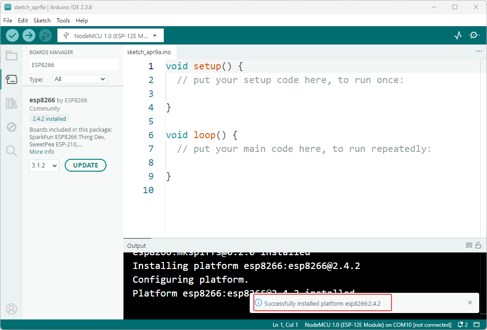

----

.. note::
   - It is recommended to install the core package version 2.0.12 for this package. Using other versions may cause program or functional abnormalities
   - During the download process of the core package, it may fail due to network failures. You can try several more times.

----

4. Add Libraries
----------------

Arduino libraries can significantly simplify the development process.

They encapsulate commonly used functions and hardware driver code, allowing users to simply call ready-made functions without writing complex low-level code from scratch.

A wealth of community-provided third-party libraries also allows for quick integration with various sensors and modules.

These library functions make it easy to interact with hardware and expand Arduino’s functionality.

A. We've compiled all the libraries necessary to run this suite. Please click the link below to download them and follow the instructions to complete the installation:  `Download libraries <https://www.dropbox.com/scl/fo/syf1zstu58f4xlcld2nss/ACJOi93PcIafo5yGabrprDA?rlkey=hoc2undykymrxac7z8nclpk9u&st=el86zaw9&dl=1>`_

----

B. Unzip the downloaded library file. The library file storage path is **Code and Libraries** → **Libraries** . Open it and confirm that it contains the library file shown in the figure below.

- Adafruit_NeoPixel.zip
- FastLED.zip

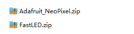

.. raw:: html

   

**Both of these library files need to be imported.**

----

C. Open the Arduino IDE and click **Sketch** → **Include Library** → **Add .ZIP Library**.

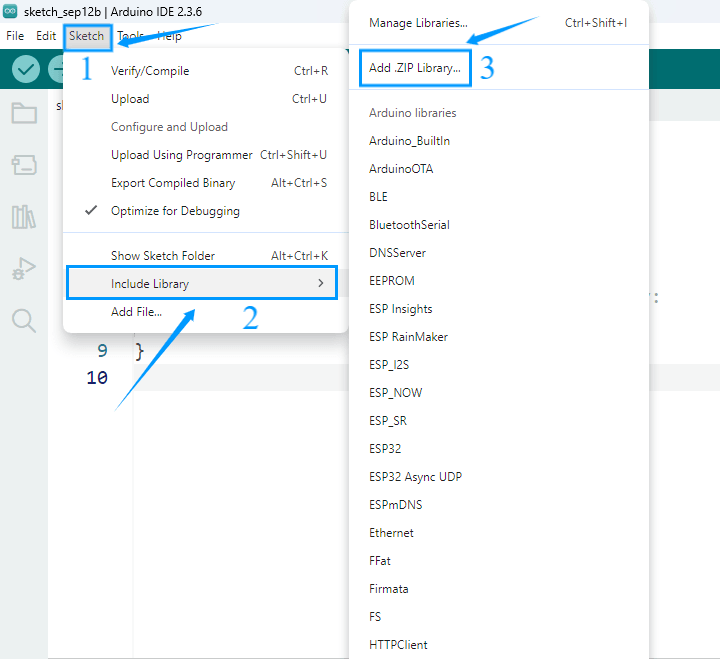

----

D. In the pop-up window, locate the folder of the library you just downloaded and unzipped, select it, and click Open to complete the import.

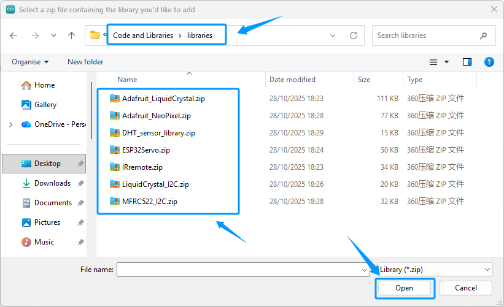

----

E. If the library file is imported successfully, the Arduino IDE output window will display the message: **Library installed**.

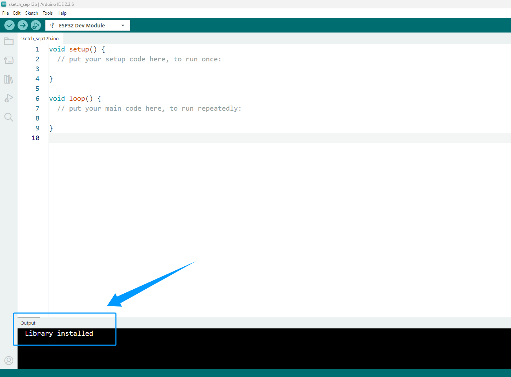

----

.. note::

   - The Arduino IDE does not support importing multiple libraries at once; you must import one library at a time, and all library files included in the resources must be imported.
   - If a library file already exists, a prompt will appear asking whether to overwrite it. It is recommended to confirm overwrite to avoid program errors caused by different library versions.

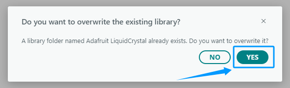

----

F. Download Libraries Using Arduino IDE

You can also download required libraries directly using the Arduino IDE.

 - On the right side of the Arduino IDE interface, click the Library Manager icon.

 - Enter keywords in the search box to find the required library and click Install to download.

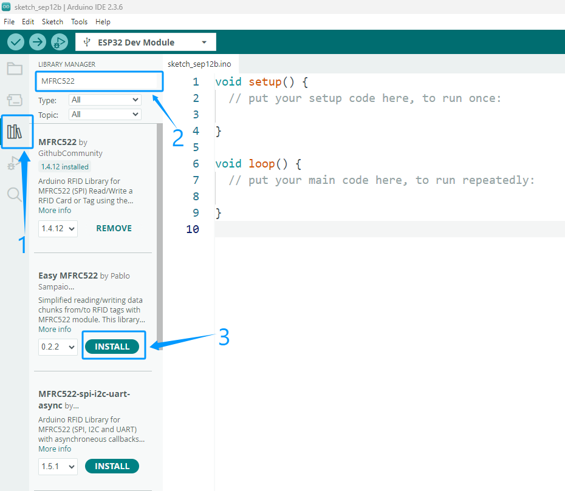

----

5. Install Serial Port Tool
---------------------------

 - After connecting the ESP32 to the computer, a USB-to-serial driver needs to be installed to establish communication. For detailed installation steps, please click here. :ref:`Install Serial Port Tool`

 - If you have already successfully installed the driver, you can skip this step.
----

6. Upload Test Code
-------------------

 - To verify that the Arduino IDE is configured correctly and the ESP32 development board is working properly, please use the following code to test the onboard LED connected to GPIO pin 2.

.. code-block:: cpp

 const int ledPin = 2; // PIN for on-board LED

 // PWM Configuration
 const int freq = 5000;      // PWM frequency (Hz)
 const int ledChannel = 0;   // Use PWM channel 0 (0-15)
 const int resolution = 8;   // 8-bit resolution (0-255)

 void setup() {
  // Configure PWM channel parameters
  ledcSetup(ledChannel, freq, resolution);
  
  // Attach PWM channel to LED pin
  ledcAttachPin(ledPin, ledChannel);
  
  // Initialize serial communication for debugging
  Serial.begin(115200);
  Serial.println("ESP32 Breathing LED Program Started!");
 }

 void loop() {
  // Breathing effect: brightness gradually increases (fade in)
  for (int dutyCycle = 0; dutyCycle <= 255; dutyCycle++) {
    ledcWrite(ledChannel, dutyCycle); // Set PWM duty cycle
    delay(5); // Controls speed (larger value = slower breathing)
  }
  
  // Breathing effect: brightness gradually decreases (fade out)
  for (int dutyCycle = 255; dutyCycle >= 0; dutyCycle--) {
    ledcWrite(ledChannel, dutyCycle); // Set PWM duty cycle
    delay(5); // Controls speed (larger value = slower breathing)
  }
  
  // Optional pause between each breathing cycle
  delay(100);
}

----

A. Copy the code above into the Arduino IDE.

B. As shown in the image below, search for and select the corresponding development board and serial port.

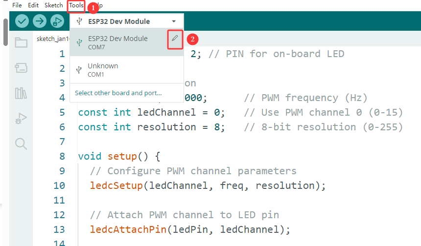

.. raw:: html

   

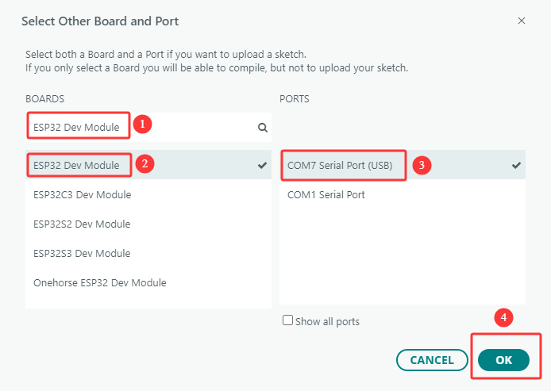

----

C. Click the **upload** button to upload the code to the development board.

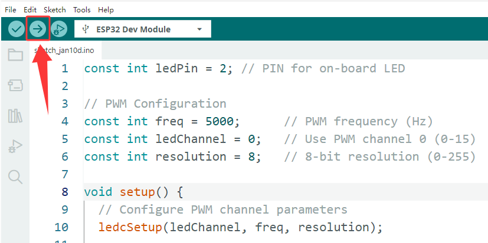

----

D. After clicking upload, the upload progress will be displayed in the output window.

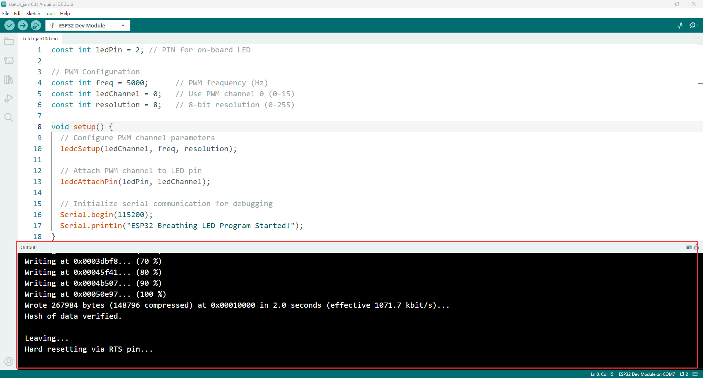

.. raw:: html

   

E. Once the output display shows that the upload is complete, press the RST button on the ESP32 development board to start the program.

.. raw:: html

   

   
F. After pressing the RST key, you can see the onboard LEDs of the ESP32 development board flashing, proving that the Arduino IDE configuration and the development board are working properly.

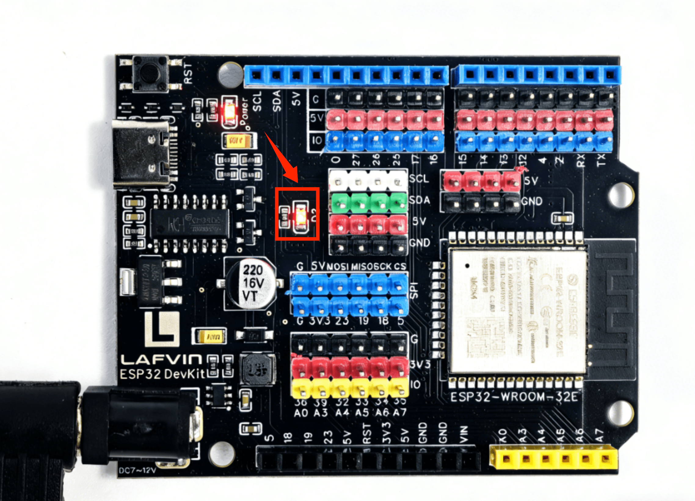

----

**Congratulations! Your Arduino IDE is ready! Now you can start writing your first program!**

----