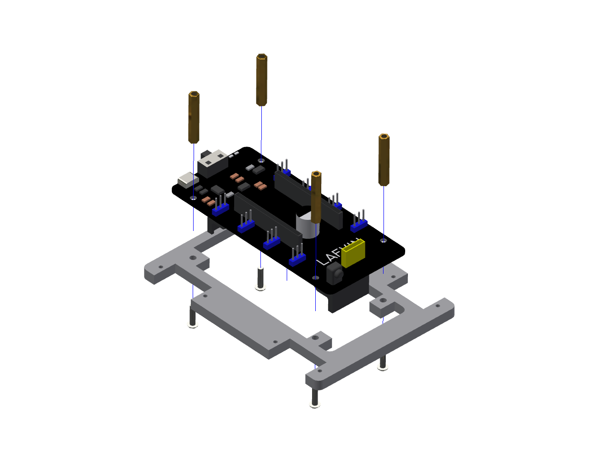
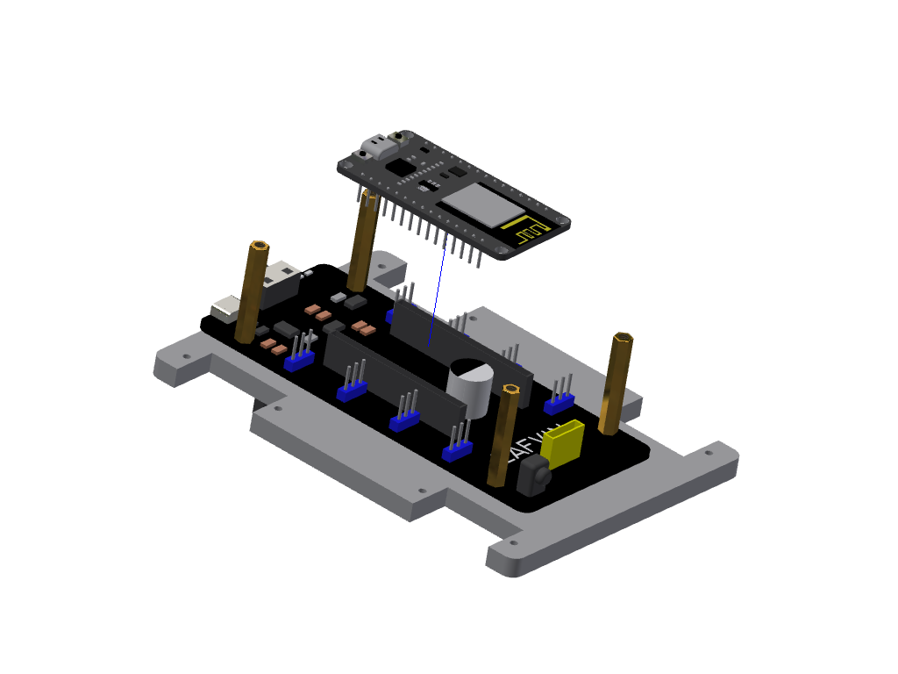
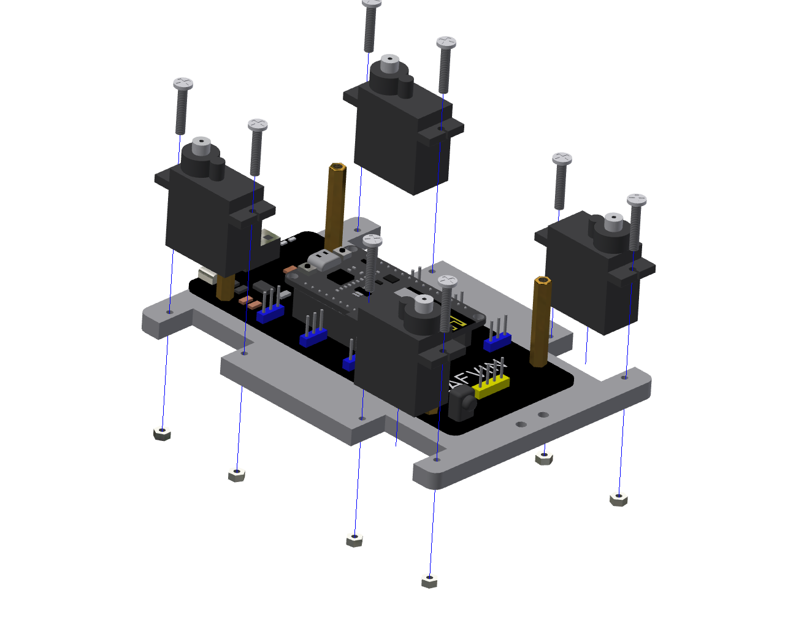

Assembly Tutorial
=================

Assembly Video
--------------

- The video provides a step-by-step assembly tutorial for the quadruped spider robot. Watching this video will help you assemble it quickly.

- For a more detailed assembly guide with text and images, please continue reading below.

----

Assembly Tutorial
-------------------

STEP 1: Assemble expansion board
~~~~~~~~~~~~~~~~~~~~~~~~~~~~~~~~

**Parts list：** Expansion board、Acrylic body panel、M3*10mm screw(4 PCS)、M3*16mm copper pillar(4 PCS).

.. raw:: html

   

----

STEP 2: Assemble development board
~~~~~~~~~~~~~~~~~~~~~~~~~~~~~~~~~~~

**Parts list：** ESP8266 development board.

.. raw:: html

   

.. note::

   Ensure the development board orientation matches the silk-screen markings on the expansion board to avoid incorrect installation.

----

STEP 3: Assemble  body servo 
~~~~~~~~~~~~~~~~~~~~~~~~~~~~~

**Parts list：** MG90S Servo(4 PCS)、M2*12mm screw(8 PCS)、M2 nut(8 PCS).

.. raw:: html

   

.. note::

   Make sure the four servos are installed with the correct orientation: the two upper servos face upward while the two lower servos face downward.

----

STEP 4: Wiring of the body servo  
~~~~~~~~~~~~~~~~~~~~~~~~~~~~~~~~

.. note::

 The MG90S servo motors are crucial components for controlling the robot's leg movements. Each servo has three wires with specific colors and functions:

 .. image:: _static/AssemblyTutorial/1.servo.png
   :width: 800
   :align: center

 .. raw:: html

   

 - **Brown Wire**: Ground (GND) - Connect to the ground pin on the expansion board
 - **Red Wire**: Power (VCC) - Connect to the 5V power pin on the expansion board
 - **Yellow Wire**: Signal (PWM) - Connect to the corresponding GPIO pin on the ESP8266 board

----

**The wiring diagram for the servo motors in the body is shown in the figure:**

 .. image:: _static/AssemblyTutorial/5.body.png
   :width: 800
   :align: center

 .. raw:: html

   

----

**Image of the assembled spider body parts:**

 .. image:: _static/AssemblyTutorial/6.bodycom.png
   :width: 800
   :align: center

 .. raw:: html

   

----

.. raw:: html

.. note::

  - After connecting the servos to the body, install the battery while ensuring the development board is properly mounted on the expansion board. Then, turn on the power of the expansion board. The system will automatically reset, and the servos will rotate to their initial positions. 
  
  - The development board must be programmed before this step; otherwise, the servo will not respond. For instructions,see :ref:`Programming Program`.

----

STEP 5: Assemble the spider's thigh 
~~~~~~~~~~~~~~~~~~~~~~~~~~~~~~~~~~~

**Parts list：** Acrylic plate for thigh(8 PCS)、One-swing arm(8 PCS)、M2*8mm self-tapping screw(16 PCS).

 .. image:: _static/AssemblyTutorial/7.baibi.png
   :width: 800
   :align: center

 .. raw:: html

   

.. note::

 - The one-swing arm and M2*8mm self-tapping screws used in this step are all included in the servo package.
 - A total of 8 need to be installed for use in subsequent steps.

----

STEP 6: Trim swing arm
~~~~~~~~~~~~~~~~~~~~~~~

To ensure smooth movement of the spider robot, please trim the servo arms to the appropriate length as shown in the diagram. Please handle with care during operation.

 .. image:: _static/AssemblyTutorial/8.xiujian.png
   :width: 800
   :align: center

 .. raw:: html

   

----

STEP 7: Assemble the thigh and femur
~~~~~~~~~~~~~~~~~~~~~~~~~~~~~~~~~~~~~

**Parts list：** The thigh of the assembled swing arm(8 PCS)、Femoral acrylic plate(4 PCS)、M3*10mm screw(8 PCS)、M3 Nut(8 PCS).

.. attention::

   The femoral plates consist of two groups with different orientations. Each group contains 2 pieces, for a total of 4 pieces. Continue reading below for detailed assembly instructions.

**The assembly of the first group is shown in the figure:**

 .. image:: _static/AssemblyTutorial/9.摆臂安装支架1-1.png
   :width: 800
   :align: center

 .. raw:: html

   

 .. image:: _static/AssemblyTutorial/10.摆臂安装支架1-2.png
   :width: 800
   :align: center

 .. raw:: html

   

**The assembly of the second group is shown in the figure:**

 .. image:: _static/AssemblyTutorial/11.摆臂连接支架2-1.png
   :width: 800
   :align: center

 .. raw:: html

   

 .. image:: _static/AssemblyTutorial/12.摆臂连接支架2-2.png
   :width: 800
   :align: center

 .. raw:: html

   

**The differences between the two different assembly methods are shown in the following figure.**

 .. image:: _static/AssemblyTutorial/13.qubie.png
   :width: 800
   :align: center

 .. raw:: html

----

STEP 8: Assemble Tibia 
~~~~~~~~~~~~~~~~~~~~~~~

**Parts list：** MG90S Servo(4 PCS)、Tibial acrylic plate(4 PCS)、M2*12mm screw(8 PCS)、M2 Nut(8 PCS)

.. attention::

  Assembling the servo motors to the tibia is also done in two groups with different orientations, two in each group. This step requires assembling a total of four tibias.

**The first set of tibias is installed as shown in the figure.**

 .. image:: _static/AssemblyTutorial/14.tibia1.png
   :width: 800
   :align: center

 .. raw:: html

   

**The second set of tibias is installed as shown in the figure.**

 .. image:: _static/AssemblyTutorial/15.tibia2.png
   :width: 800
   :align: center

 .. raw:: html

   

**Completed assembly of two sets of tibias:**

 .. image:: _static/AssemblyTutorial/16.tibia3.png
   :width: 800
   :align: center

 .. raw:: html

   

  
----

STEP 9: Assemble the tibia and femur
~~~~~~~~~~~~~~~~~~~~~~~~~~~~~~~~~~~~~

.. attention::

  Tibia and femur assembly is also divided into two different assembly directions, with two in each group, requiring the assembly of four bones per group.

**The first group of tibia and femur assembly is shown in the figure.**

 .. image:: _static/AssemblyTutorial/17.触角1.png
   :width: 800
   :align: center

 .. raw:: html

   

  
**The second group of tibia and femur assembly is shown in the figure.**

 .. image:: _static/AssemblyTutorial/18.触角2.png
   :width: 800
   :align: center

 .. raw:: html

   

**The completed results of the two groups of tibia and femur are shown in the figure.**

 .. image:: _static/AssemblyTutorial/19.触角3.png
   :width: 800
   :align: center

 .. raw:: html

   

----

STEP 9: Servo connected to the tibia
~~~~~~~~~~~~~~~~~~~~~~~~~~~~~~~~~~~~

