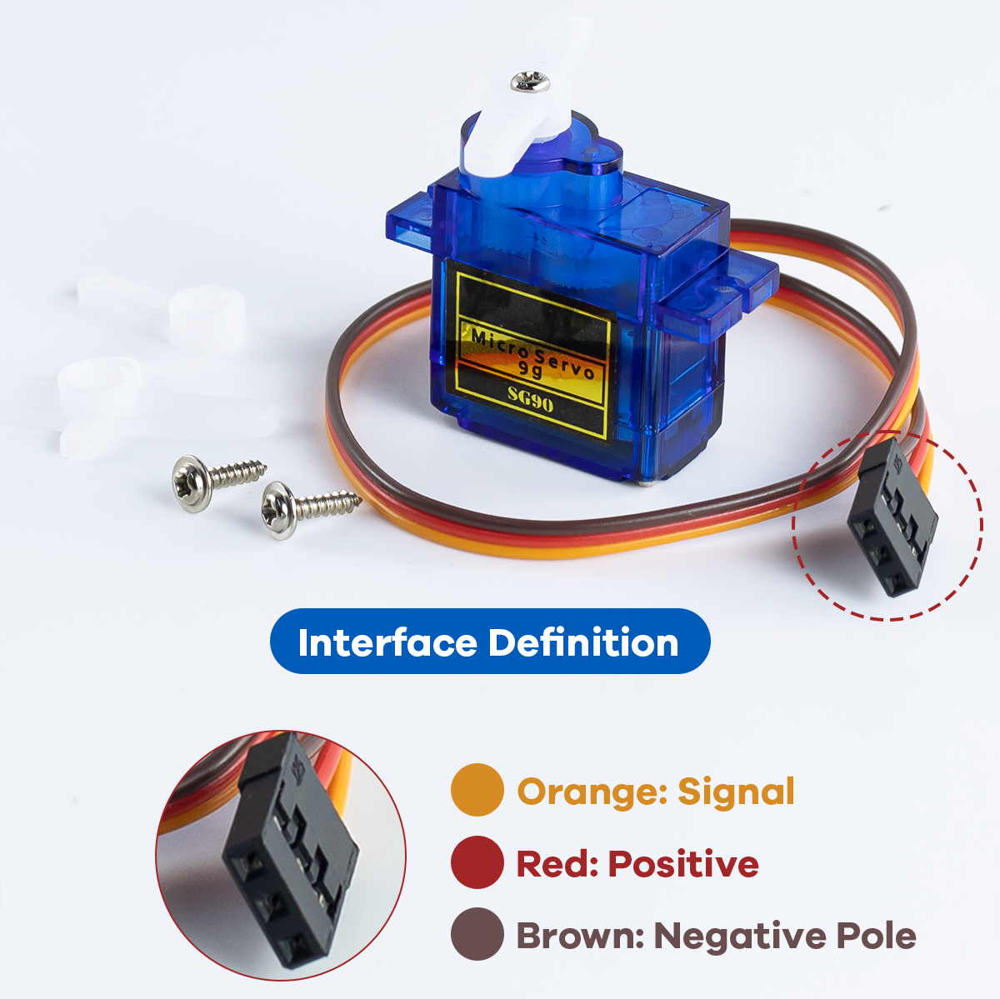

Assembly Tutorial
=================

Assembly Video
--------------

- The video provides a step-by-step assembly tutorial for the quadruped spider robot. Watching this video will help you assemble it quickly.

- For a more detailed assembly guide with text and images, please continue reading below.

----

Wiring Diagram
--------------

MG90S Servo Wiring
~~~~~~~~~~~~~~~~~~

The MG90S servo motors are crucial components for controlling the robot's leg movements. Each servo has three wires with specific colors and functions:

.. raw:: html

   

- **Brown/Black Wire**: Ground (GND) - Connect to the ground pin on the expansion board
- **Red Wire**: Power (VCC) - Connect to the 5V power pin on the expansion board
- **Orange/Yellow Wire**: Signal (PWM) - Connect to the corresponding GPIO pin on the ESP8266 board

The quadruped spider robot uses 8 MG90S servos total - 2 per leg (hip and knee joints). Proper wiring ensures smooth and precise movement control.

----
