Components Introduction
=======================

**Below is the introduction to each component, which contains the operating principle of the component.**

----

1. ESP32 DevKit
---------------

The development board features the ESP32-WROOM-32E module, which has been optimized in chip manufacturing process, effectively reducing power consumption and improving signal quality, thus ensuring a stable and reliable user experience. 

This module supports 2.4 GHz Wi-Fi and Bluetooth dual-mode communication, and is equipped with a dual-core Xtensa 32-bit LX6 processor with a clock speed of up to 240MHz, 448KB ROM, 520KB SRAM, and 16KB RTC SRAM, as well as 4MB of external Flash memory. 

Furthermore, the development board provides up to 26 I/O interfaces, making it suitable for IoT scenarios such as embedded systems, smart homes, and wearable electronic devices. It is compatible with various common development environments such as Arduino, combining excellent performance with outstanding ease of use.

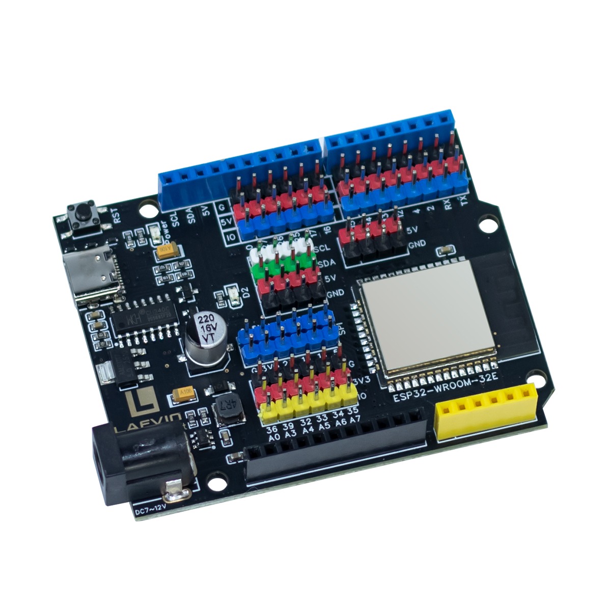

The 26 I/O pins are brought out using female headers for easy connection with DuPont wires;

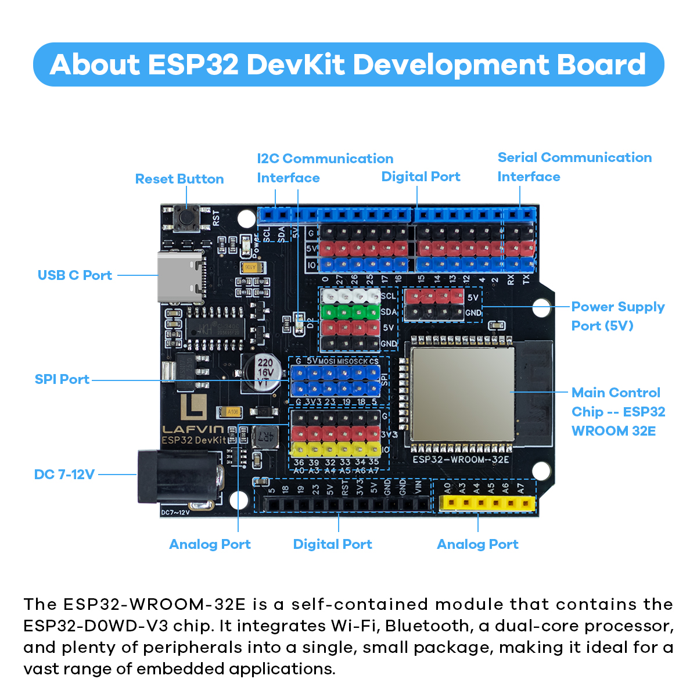

It features an onboard 2.54mm pitch S/V/G expansion header interface, with independent I2C, SPI, and ADC pins; it also has an independent 5V power supply output;

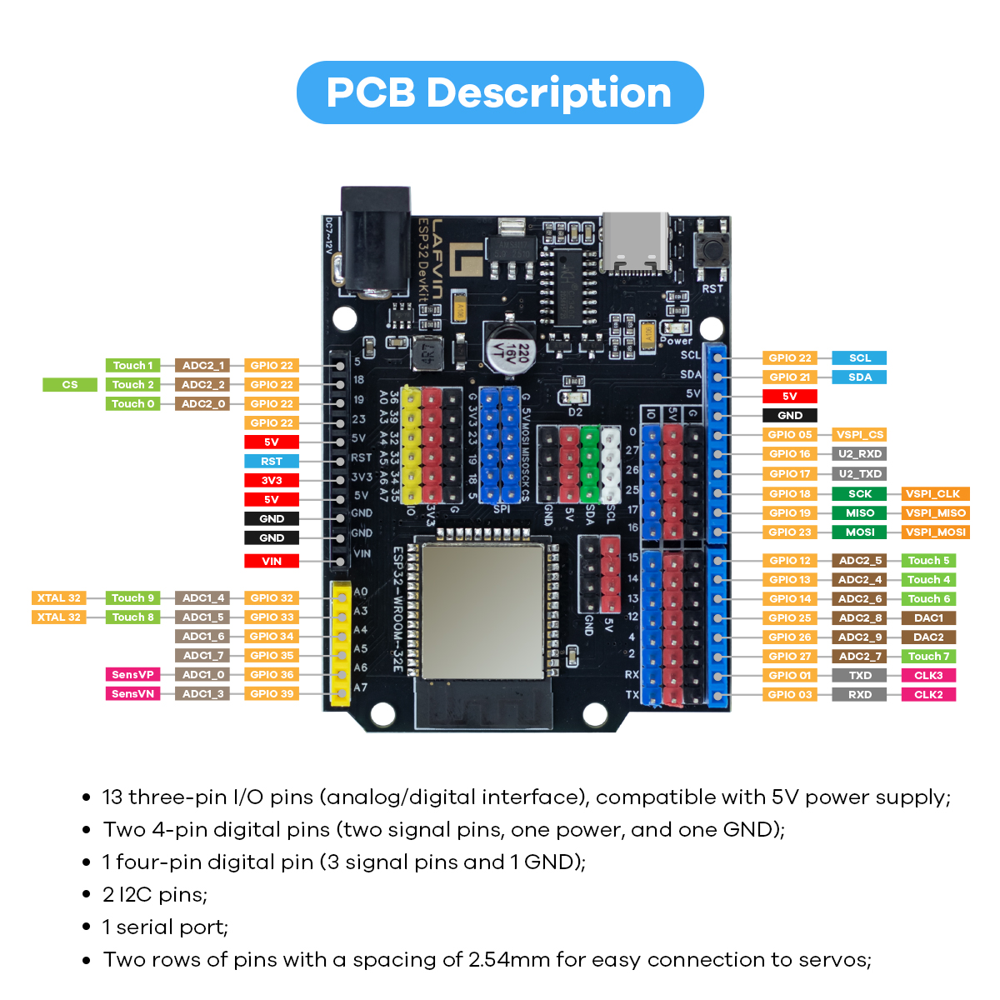

----

2. Bread Board
-------------

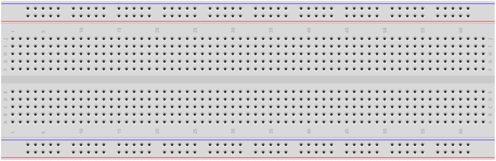

.. raw:: html

   

A breadboard is a construction base for prototyping of electronics. Originally the word referred to a literal bread board, a polished piece of wood used for slicing bread. In the 1970s the solderless breadboard (a.k.a. plugboard, a terminal array board) became available and nowadays the term "breadboard" is commonly used to refer to these.

It is used to build and test circuits quickly before finishing any circuit design. 
And it has many holes into which components mentioned above can be inserted like ICs and resistors as well as jumper wires. 
The breadboard allows you to plug in and remove components easily. 

The picture shows the internal structure of a breadboard. 
Although these holes on the breadboard appear to be independent of each other, they are actually connected to each other through metal strips internally.

.. image:: _static/Component/2.bread.png
   :width: 800
   :align: center

.. raw:: html

   

.. note:: 
    G1 and G2, V1 and V2 in the breadboard are not connected. Usually you need to use jumper wires to connect them.

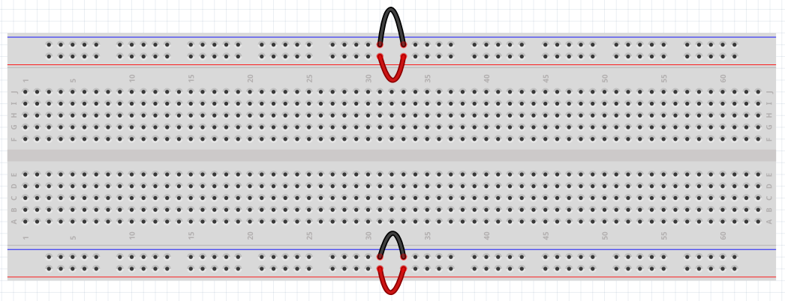

----

3. jumper wires
---------------

Wires that link two terminals are known as jumper wires. There are various types of jumper wires, but here we will focus on those commonly used with breadboards. They serve to transmit electrical signals from any point on the breadboard to the input/output pins of a microcontroller.

Jumper wires are connected by inserting their "end connectors" into the slots of the breadboard. Underneath the breadboard's surface, there are sets of parallel plates that connect these slots in groups of rows or columns, depending on the section of the board. The "end connectors" are placed into the desired slots on the breadboard without soldering, making connections as needed for the specific prototype.

There are three main types of jumper wires: Female-to-Female, Male-to-Male, and Male-to-Female. The names describe the connectors on each end. Male-to-Female wires have a protruding pin on one end and a recessed female connector on the other. Male-to-Male wires have pins on both ends, while Female-to-Female wires have sockets on both ends.

.. image:: _static/Component/7.wiring.png
   :width: 800
   :align: center

.. raw:: html

   

In learning this kit, we only used male-to-male jumper wires.

Multiple types of jumper wires can be utilized in a single project. Although jumper wires come in various colors, these colors do not indicate differences in their function. The colors are simply a design feature to help distinguish and identify the connections between different parts of the circuit more easily.

----

4. Button
--------

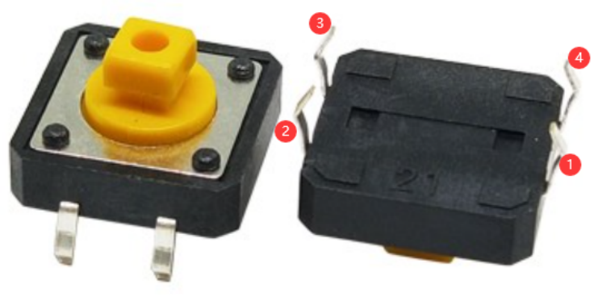

Buttons are essential components used to control electronic devices, typically functioning as switches to either complete or interrupt circuits. Despite their variety in sizes and shapes, the 12mm button depicted in the accompanying images is our focus here. Within this button, pin 1 is connected to pin 2, and pin 3 is connected to pin 4. Therefore, you only need to establish a connection between pin 1 (or pin 2) and pin 3 (or pin 4) to operate it.

The internal structure of such a button is illustrated below. The symbol shown on the right is commonly used to represent a button in circuit diagrams.

.. image:: _static/Component/9.button.png
   :width: 800
   :align: center

Since the pin 1 is connected to pin 2, and pin 3 to pin 4, when the button is pressed, the 4 pins are connected, thus closing the circuit.

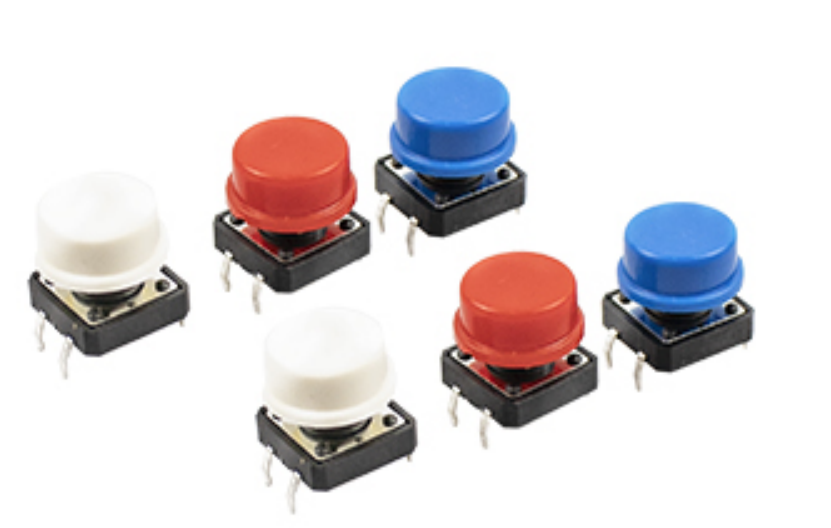

----

5. Speaker
-----------

The loudspeaker is a classic example of the combination of modern acoustics and electronics. Its core function is to convert electrical signals into sounds that we can hear.

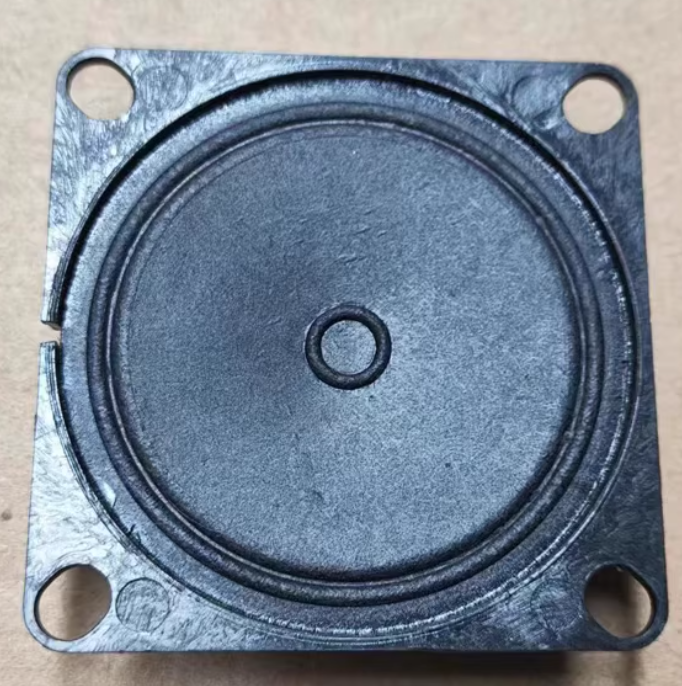

.. raw:: html

   

A typical loudspeaker mainly consists of the following components:

Permanent magnet: Provides a constant, strong magnetic field.

Voice coil: A lightweight coil wound around a frame, located within the gap in the magnetic field.

Diaphragm: A conical or dome-shaped thin film, usually made of paper, plastic, or composite materials, with its edges secured to the frame by pleats.

Centering support: A flexible, corrugated ring used to support the voice coil, allowing it to move precisely in the magnetic gap without rubbing against the magnet.

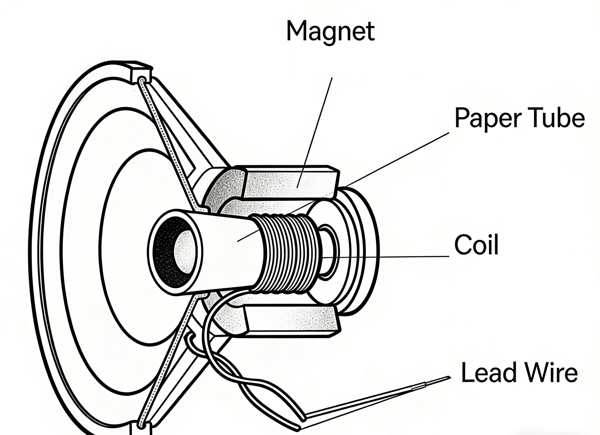

----

6. RGB Strip Light
------------------

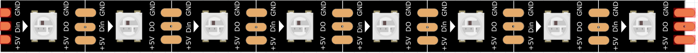

.. raw:: html

   

The WS2812 RGB 8 LEDs Strip is composed of 8 RGB LEDs. Only one pin is required to control all the LEDs. Each RGB LED has a WS2812 chip, which can be controlled independently. It can realize 256-level brightness display and complete true color display of 16,777,216 colors. At the same time, the pixel contains an intelligent digital interface data latch signal shaping amplifier drive circuit, and a signal shaping circuit is built in to effectively ensure the color height of the pixel point light Consistent.

It is flexible, can be docked, bent, and cut at will, and the back is equipped with adhesive tape, which can be fixed on the uneven surface at will, and can be installed in a narrow space.

WS2812B is a intelligent control LED light source that the control circuit and RGB chip are integrated in a package of 5050 components. It internal include intelligent digital port data latch and signal reshaping amplification drive circuit. Also include a precision internal oscillator and a 12V voltage programmable constant current control part, effectively ensuring the pixel point light color height consistent.

The data transfer protocol use single NZR communication mode. After the pixel power-on reset, the DIN port receive data from controller, the first pixel collect initial 24bit data then sent to the internal data latch, the other data which reshaping by the internal signal reshaping amplification circuit sent to the next cascade pixel through the DO port. After transmission for each pixel, the signal to reduce 24bit. pixel adopt auto resha -ping transmit technology, making the pixel cascade number is not limited the signal transmission, only depend on the speed of signal transmission.

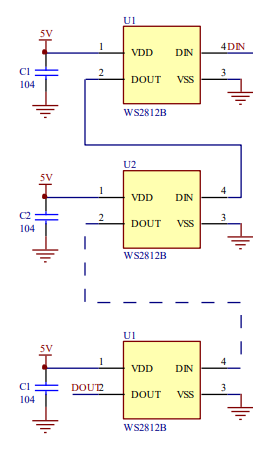

.. raw:: html

   

LED with low driving voltage, environmental protection and energy saving, high brightness, scattering angle is large, good consistency, low power, long life and other advantages. The control chip integrated in LED above becoming more simple circuit, small volume, convenient installation.

----