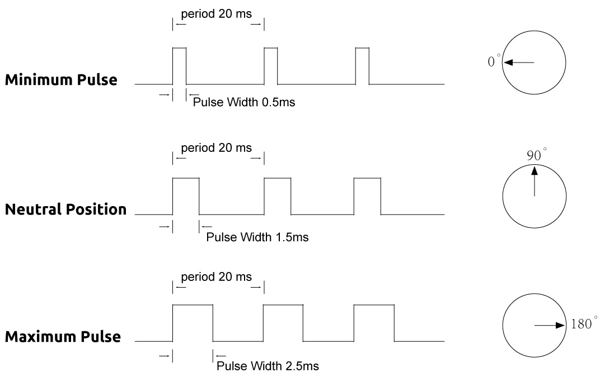
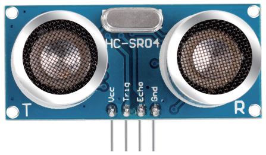
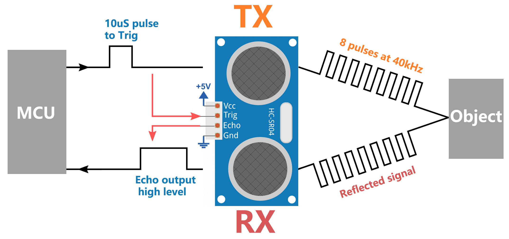

Components Introduction
=======================

**Below is the introduction to each component, which contains the operating principle of the component.**

----

ESP8266 Development Board
--------------------------

The **ESP8266** is a low-cost, highly integrated Wi-Fi microcontroller system-on-chip (SoC) designed for IoT and embedded applications. It features a 32-bit RISC processor with built-in Wi-Fi capability, making it ideal for smart home devices, robotics, and connected sensors.

**Key Features:**

- **Processor**: 32-bit RISC (Tensilica L106) running at 80/160 MHz
- **Memory**: 160 KB RAM, 4 MB Flash (typical, expandable)
- **Wi-Fi**: 802.11 b/g/n support, single-band 2.4 GHz
- **GPIO Pins**: 11 programmable general-purpose I/O pins
- **Communication Protocols**: SPI, I2C, UART, PWM
- **Power Supply**: 3.3V DC, low power consumption (~20 μA in sleep mode)
- **Boot Mode**: Selectable via IO pin configuration

**Operating Principle:**

The ESP8266 operates based on a Xtensa processor core with an integrated Wi-Fi radio (MAC and PHY). It supports both STA (Station) and AP (Access Point) modes, allowing it to connect to existing networks or create its own hotspot. Programs are typically written in the Arduino IDE or MicroPython environment and burned into the onboard flash memory via USB-to-UART bridge (CP2102 in this kit). Upon reset, the bootloader loads the firmware from flash and executes the user program.

----

Quadruped Spider Robot Expansion Board
--------------------------------------

The Quadruped Spider Robot Expansion Board is specifically designed for this kit. It features an onboard battery compartment and charging functionality, along with multiple circuit protection designs including reverse polarity protection and fuses. It also includes large capacitors to enhance system stability and instantaneous response capability, ensuring smooth and reliable servo operation. Additionally, it extends the ESP8266 development board's pins for easy wiring.

The following is a pinout diagram of the expansion board and the ESP8266 development board:

.. list-table::
   :header-rows: 1
   :widths: 50 50

   * - Digital Pin
     - GPIO
   * - D0
     - GPIO16
   * - D1
     - GPIO5
   * - D2
     - GPIO4
   * - D3
     - GPIO0
   * - D4
     - GPIO2
   * - D5
     - GPIO14
   * - D6
     - GPIO12
   * - D7
     - GPIO13
   * - D8
     - GPIO15

----

MG90S Servo
-----------

The **MG90S Servo** is a small, lightweight servo motor widely used in robotics and RC applications. It features high torque, fast response time, and precise angle control, making it ideal for driving the legs of the spider robot in this kit.

**Operating Principle:**

The MG90S is controlled via PWM signals. The pulse width (duration of the high signal) determines the servo position:

- **1.0 ms pulse**: 0° (full counterclockwise)
- **1.5 ms pulse**: 90° (neutral/center position)
- **2.0 ms pulse**: 180° (full clockwise)
- **Frequency**: 50 Hz (20 ms period)

.. raw:: html

   

When the ESP8266 sends a PWM signal to the servo via the expansion board, the servo's internal circuitry decodes the pulse width and moves the output shaft to the corresponding angle. The servo continuously adjusts its position to match the target angle until it receives a new command.

The expansion board has dedicated servo ports that simplify wiring and provide stable power distribution to ensure smooth servo operation.

**Common Applications in Spider Robot:**

- Driving the four legs through hip, knee, and ankle joints
- Independent control of each servo allows the robot to move in different directions
- Synchronized servo control enables walking, turning, and dynamic movements

----

Ultrasonic Distance Sensor
--------------------------

.. raw:: html

   

The **HC-SR04 Ultrasonic Distance Sensor** is a popular ultrasonic ranging sensor that uses sound waves to measure distance. It provides accurate, non-contact distance measurement, making it perfect for obstacle detection and navigation in robotics applications like the spider robot.

**Key Specifications:**

- **Operating Voltage**: 5V DC
- **Measurement Range**: 2 cm to 400 cm
- **Accuracy**: ±3 mm
- **Resolution**: 1 mm
- **Trigger Signal**: 10 μs TTL pulse
- **Echo Signal**: Pulse width proportional to distance
- **Frequency**: 40 kHz ultrasonic waves
- **Current Consumption**: 15 mA (active), <2 mA (standby)

**Operating Principle:**

The HC-SR04 works by emitting ultrasonic sound waves and measuring the time it takes for the echo to return:

.. raw:: html

   

1. **Trigger**: A 10 μs high pulse on the Trig pin initiates measurement
2. **Transmission**: The sensor sends out 8 pulses of 40 kHz ultrasonic waves
3. **Echo Reception**: The Echo pin goes high when the waves are sent and stays high until the echo is received
4. **Distance Calculation**: Distance = (Echo pulse width × Speed of sound) / 2

The speed of sound in air is approximately 343 m/s (at 20°C). The formula is: Distance (cm) = (Echo pulse width in μs) / 58.2

**Common Applications in Spider Robot:**

- Obstacle detection to avoid collisions during movement

----
