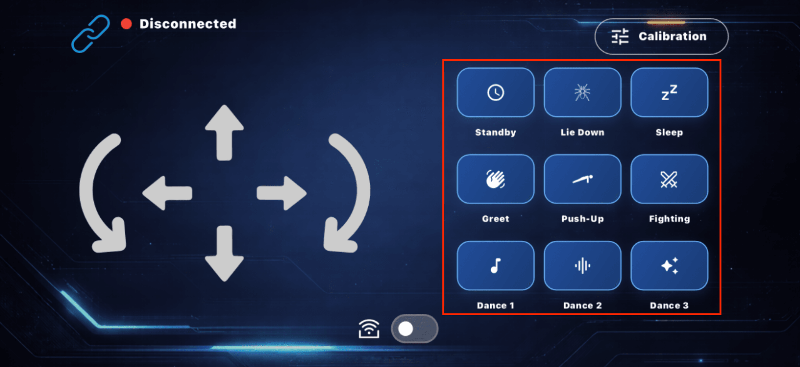
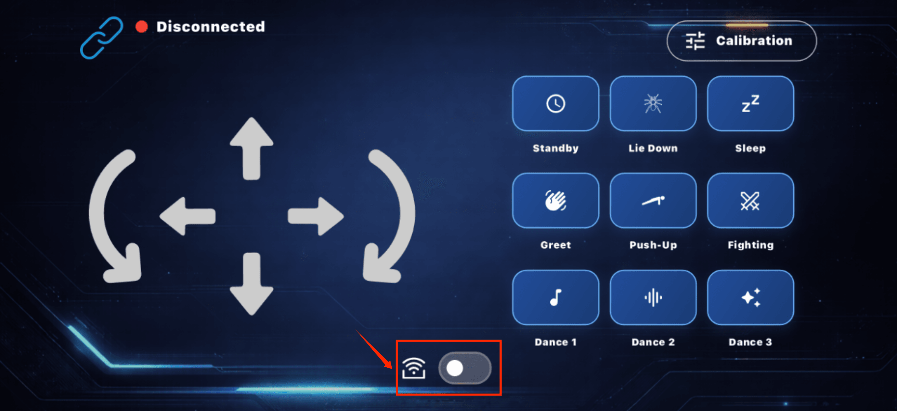
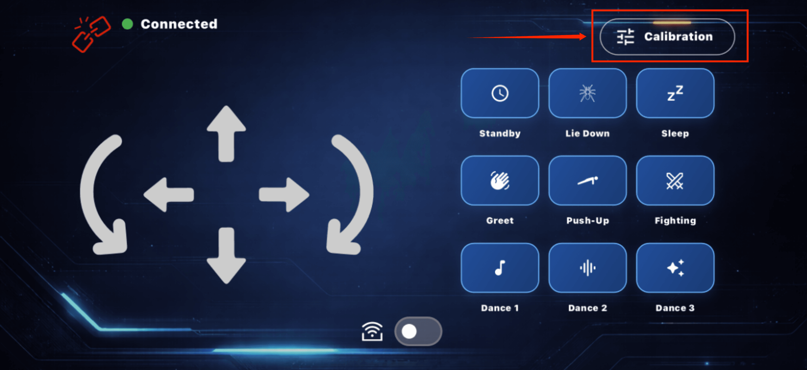
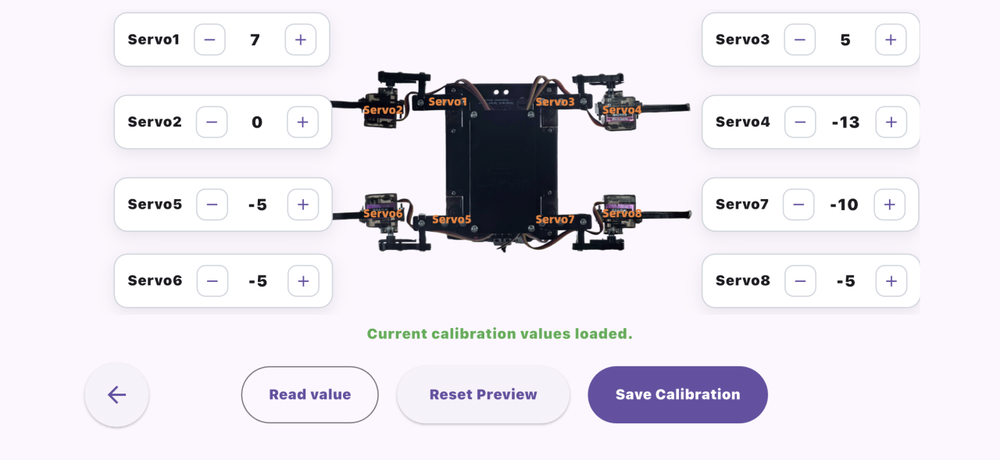
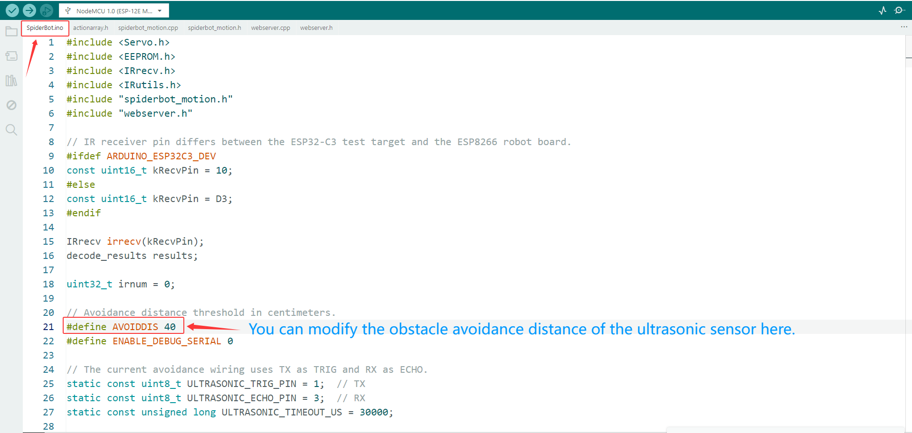

Control Method Tutorial
=======================

**This kit's quadruped spider robot has three control methods: infrared remote control, mobile APP control, and automatic obstacle avoidance mode.The following sections will introduce the usage tutorials for each of these three methods.**

----

.. _APP control:

APP control
-----------

1. Download program：Scan the QR code below to go to the app download page.

.. image:: _static/APP/1.APP.png
    :width: 500
    :align: center

.. raw:: html

   

2. Turn on the power to the quadrupedal spider robot, turn on your phone's Wi-Fi, and find and connect to the Wi-Fi network named **Robot-XXXX**.The password is: **12345678**

.. image:: _static/APP/2.wifi.png
    :width: 500
    :align: center

.. raw:: html

   

3. Open the app and click the connection icon in the upper left corner of the interface to connect.

.. image:: _static/APP/3.APP.png
    :width: 800
    :align: center

.. raw:: html

   

.. image:: _static/APP/4.APP.png
    :width: 800
    :align: center

.. raw:: html

   

4. The status changing to "Connected" indicates that the connection has been successfully established.

.. attention::

  - If the connection fails, please ensure that the Wi-Fi connection is working properly and enable Wi-Fi access for the app in the settings.
  
  - The following is an illustration of enabling Wi-Fi permission on an iOS system：Setting-Apps-Spiderbot-Wireless Ddta-WLAN & Cellular Data.

  .. image:: _static/APP/11.wifi.png
    :width: 800
    :align: center

  .. raw:: html

   

5. The left side of the interface controls direction, allowing you to move forward, backward, left, right, turn left, and turn right.

.. raw:: html

   

6. The right side of the interface displays nine preset actions; click the icon to perform the action.

.. raw:: html

   

7. At the bottom of the interface is the switch for automatic obstacle avoidance mode. When turned on, the spider robot will enter obstacle avoidance mode and move automatically.

.. raw:: html

   

8. The servo calibration button is located in the upper right corner of the interface. Clicking it will take you to the servo calibration page. For detailed calibration instructions, click here to view the instructions. :ref:`Servo calibration and debug`

.. raw:: html

   

.. raw:: html

   

----

Infrared Remote Control
-----------------------

- The infrared remote control supports the same quadruped spider robot control functions as the app. See the diagram below for the specific button mappings.

- When operating the infrared remote control, please ensure that it is aligned with the infrared receiver on the expansion board; otherwise, the buttons may become unresponsive.

Automatic Obstacle Avoidance
----------------------------

- You can enter automatic obstacle avoidance mode by turning it on in the app or by pressing the number **0** key on the infrared remote control.

- The automatic obstacle avoidance logic of the quadruped spider robot is as follows: In the default state, it continues to move forward; when an obstacle is detected within 40 centimeters in front, the robot will perform a turning obstacle avoidance action until the path ahead is unobstructed and then resumes straight movement.

- The default detection distance for automatic obstacle avoidance is 40 centimeters. This can be adjusted by modifying the code; see the image below for the specific code location.

.. raw:: html

   

.. note::

    After making the changes, you need to recompile the code and upload it to the ESP8266 development board for the changes to take effect.

----
