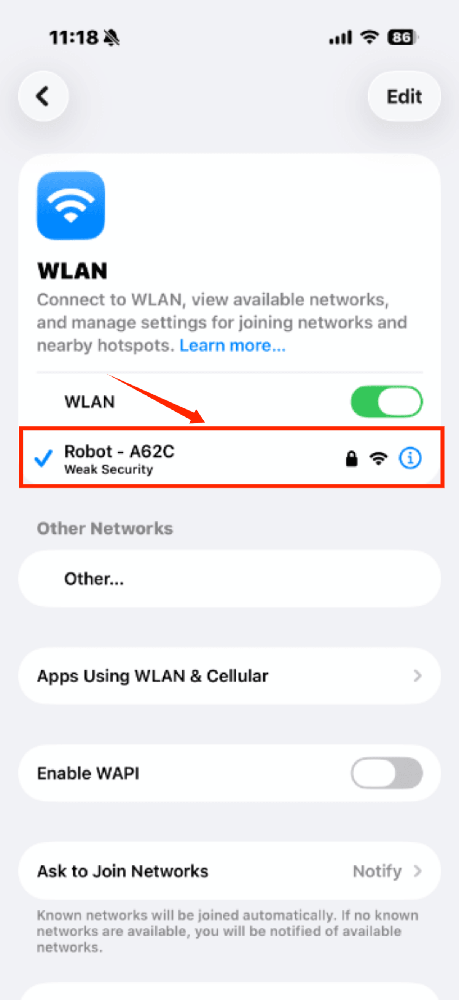
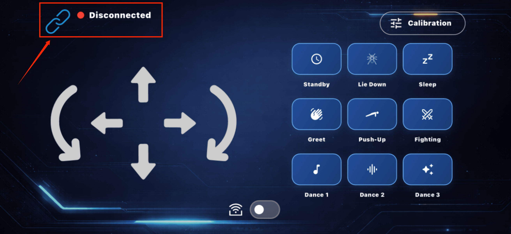
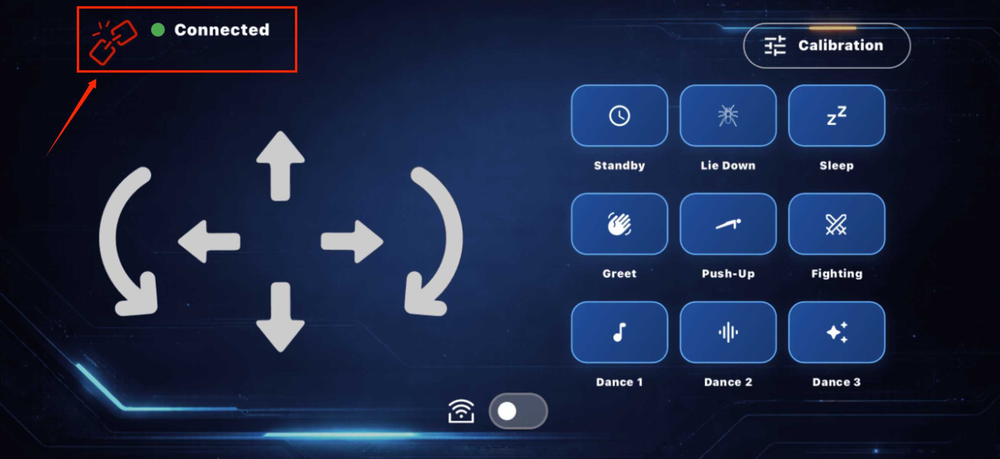

Control Method Tutorial
=======================

**This kit's quadruped spider robot has three control methods: infrared remote control, mobile APP control, and automatic obstacle avoidance mode.The following sections will introduce the usage tutorials for each of these three methods.**

----

APP control
-----------

1. Download program：Scan the QR code below to go to the app download page.

.. raw:: html

   

2. Turn on the power to the quadrupedal spider robot, turn on your phone's Wi-Fi, and find and connect to the Wi-Fi network named **Robot-XXXX**.The password is: **12345678**

.. raw:: html

   

3. Open the app and click the connection icon in the upper left corner of the interface to connect.

.. raw:: html

   

.. raw:: html

   

**The status changing to "Connected" indicates that the connection has been successfully established.**

Infrared Remote Control
-----------------------

Automatic Obstacle Avoidance
----------------------------

