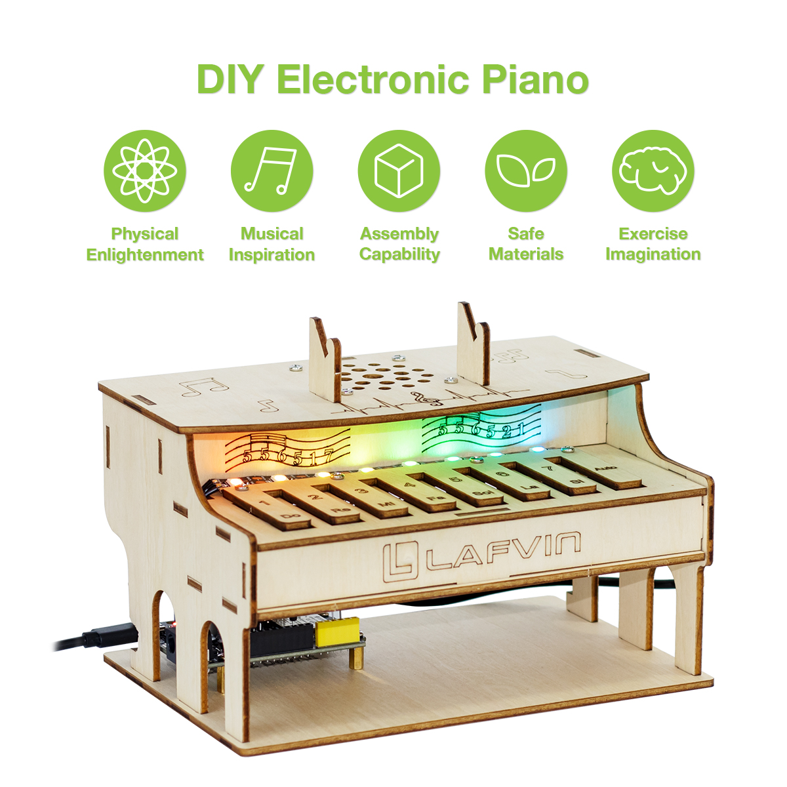
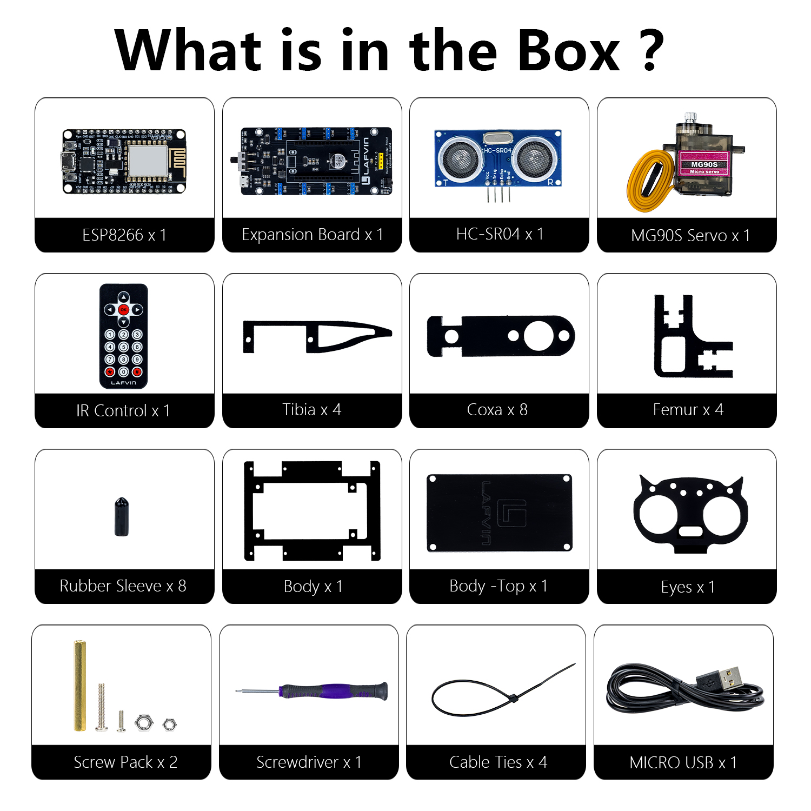

**Dear maker friends, welcome to the learning world of the ESP32 DIY Electronic Piano!**

**Please read this documentation carefully. If you encounter any problems during use, please contact our after-sales support team, and we will assist you as soon as possible.**

----

**ESP32 DIY Electronic Piano**

----

Introduction
============

*This is a smart electronic keyboard learning kit based on the ESP32 microcontroller, integrating programming learning, music education, and electronic engineering. Through vivid light effects and realistic scales, learners can grasp modern technological principles while creating music.*

1. Dual-Mode Playing System
Manual Playing Mode: 7 touch buttons correspond to the complete scale（Do-Si）, supporting real-time playing.
Automatic Playing Mode: 3 built-in classic songs play automatically:
"Twinkle Twinkle Little Star"、"Jingle Bells"、"Happy Birthday".

2. Intelligent Visual Feedback System
8 Programmable RGB LED Beads
Manual Mode: Dynamic lighting effects triggered by a button, with a high-brightness center and gradient on both sides
Automatic Mode: Three exclusive light shows

3. Precision Audio System
PWM audio output for accurate pitch.
Manual mode supports beat quantization（120 BPM）.
Automatic mode includes original track rhythm reproduction.

----

Bill of Materials
-----------------

.. list-table:: Bill of Materials
   :header-rows: 1
   :widths: 10 40 20
   :align: center

   * - Serial Number
     - Name
     - Quantity
   * - 1
     - ESP32 Devkit
     - x1
   * - 2
     - Bread Board
     - x1
   * - 3
     - Speaker
     - x1  
   * - 4
     - Button Module
     - x9
   * - 5
     - Button Cap
     - x9
   * - 6
     - RGB Light Strip
     - x1 
   * - 7
     - Screw package
     - x1 
   * - 8
     - Phillips screwdriver
     - x1 
   * - 9
     - Type-C data cable
     - x1
   * - 10
     - Basswood Board
     - x7
   * - 11
     - Jumper Wire
     - Several

Upon receiving the kit, please first check all components against the above bill of materials. If you find any missing or damaged items, please contact our technical support team immediately.

----

Resource Download
-----------------

All the necessary code and library files for this course are provided. You can obtain all the resources through the following link.

`Code and Libraries <https://www.dropbox.com/scl/fo/6b87ngd7sfcc3ek2p17dv/AJNwM44iGBfCzATI8DuXs1o?rlkey=u1lkd4h4v1velwep2134m3sr8&st=8xsktcqb&dl=0>`_

`Flash Download Tool <https://www.dropbox.com/scl/fo/r81afjixw65y88jikwxno/AM8XTGDtfcEJDgN0jHyMbRY?rlkey=4lvaoh0axd9nhvk9al7qukoi5&st=1hqtehms&dl=1>`_

`Serial Port Tool <https://www.dropbox.com/scl/fo/c4bb59fr42qcs9cxgexan/AIMImtqevecMqYNMJVK1ZBM?rlkey=9afntuwy2usxfxbl7xjkoirsy&st=89a5bx6b&dl=1>`_

----

**Next, we will delve into the core content of the course and help you gradually understand the relevant concepts and master the operation procedures.**

----
