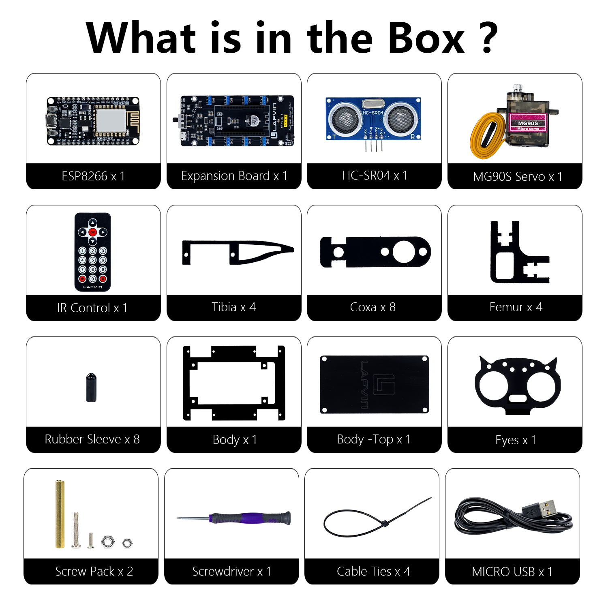

**Dear maker friends, welcome to the learning world of the LAFVIN Quadruped Spider Robot!**

**Please read this documentation carefully. If you encounter any problems during use, please contact our after-sales support team, and we will assist you as soon as possible.**

----

**LAFVIN Quadruped Spider Robot**

----

Introduction
============

This quadruped spider robot, based on the ESP8266, features a multi-degree-of-freedom design and offers a wide range of flexible movements. It integrates Wi-Fi, infrared remote control, and ultrasonic obstacle avoidance, and is equipped with eight MG90 servos, supporting six postures and nine preset actions. A comprehensive curriculum is included, and open-source code supports secondary development, making it suitable for teaching, demonstrations, research, and maker projects.

1. Wi-Fi/Infrared Dual-Mode Remote Control: Supports both APP and infrared remote control.

2. Ultrasonic Intelligent Obstacle Avoidance: Automatically detects the distance to obstacles ahead and automatically steers when an obstacle is encountered.

3. Entertainment Performance: Bionic design with multiple preset dance and movement modes for performance demonstrations.

----

Bill of Materials
-----------------

.. list-table:: Bill of Materials
   :header-rows: 1
   :widths: 10 40 20
   :align: center

   * - Serial Number
     - Name
     - Quantity
   * - 1
     - ESP8266 Development Board
     - x1
   * - 2
     - Quadruped Spider Extension Board
     - x1
   * - 3
     - Ultrasonic Distance Sensor
     - x1
   * - 4
     - MG90 Servo 
     - x8
   * - 5
     - Infrared Remote Controller
     - x1
   * - 6
     - Custom Acrylic Plate Set
     - x1
   * - 7
     - Micro USB Data Cable
     - x1
   * - 8
     - Screw Package
     - x1
   * - 9
     - Phillips Screwdriver
     - x1
   * - 10
     - Cable Ties
     - x4
   * - 11
     - Anti-slip Rubber Sleeves
     - x8

Upon receiving the kit, please first check all components against the above bill of materials. If you find any missing or damaged items, please contact our technical support team immediately.

----

Resource Download
-----------------

All the necessary code and library files for this course are provided. You can obtain all the resources through the following link.

`Code and Libraries <https://www.dropbox.com/scl/fo/6b87ngd7sfcc3ek2p17dv/AJNwM44iGBfCzATI8DuXs1o?rlkey=u1lkd4h4v1velwep2134m3sr8&st=8xsktcqb&dl=0>`_

`Flash Download Tool <https://www.dropbox.com/scl/fo/r81afjixw65y88jikwxno/AM8XTGDtfcEJDgN0jHyMbRY?rlkey=4lvaoh0axd9nhvk9al7qukoi5&st=1hqtehms&dl=1>`_

`Serial Port Tool <https://www.dropbox.com/scl/fo/c4bb59fr42qcs9cxgexan/AIMImtqevecMqYNMJVK1ZBM?rlkey=9afntuwy2usxfxbl7xjkoirsy&st=89a5bx6b&dl=1>`_

----

**Next, we will delve into the core content of the course and help you gradually understand the relevant concepts and master the operation procedures.**

----
