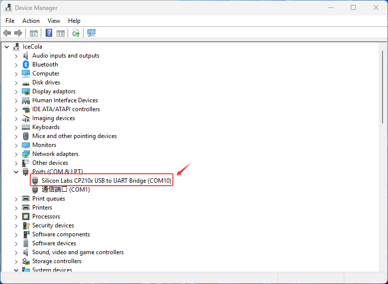
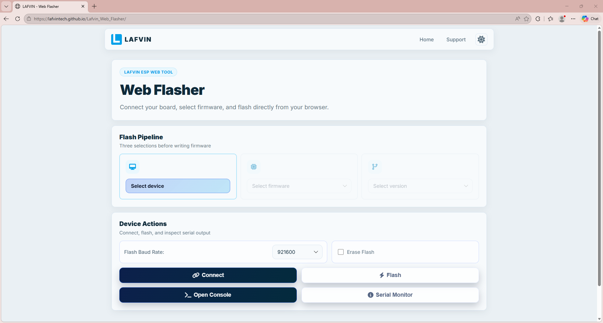
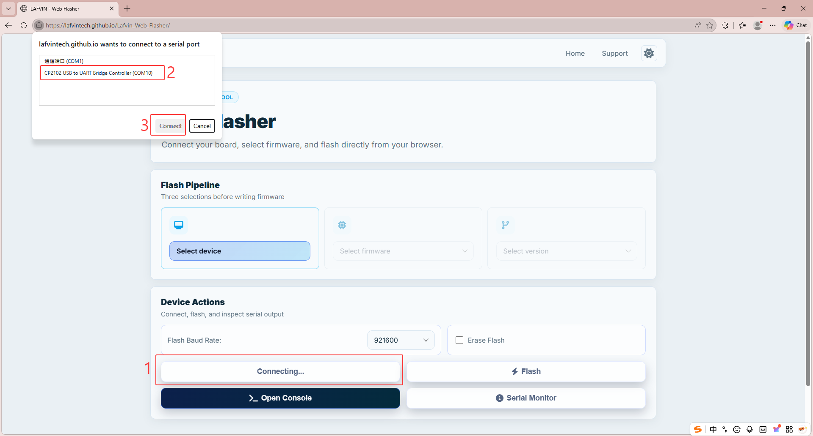
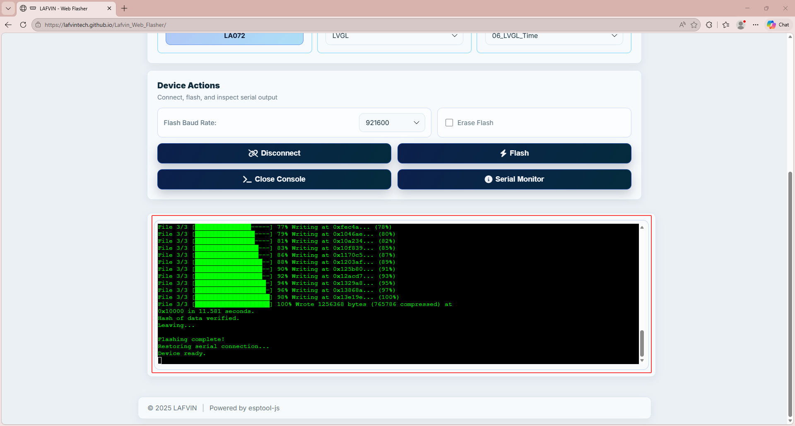

Programming Program
===================

**The kit is shipped without firmware preloaded, so no response after power-up is normal. Follow the steps below to program the spider robot and make it move.**

----

.. _Install Serial Port Tool:

1. Install Serial Port Tool
---------------------------

This kit uses an ESP8266 board with a CP2102 USB-to-UART bridge. Ensure the CP2102 driver is installed on your computer before connecting the board, or the serial port will not be detected. Connect the board, press Win+X to open Device Manager, and verify the driver is installed. If not, use the link below to download and install it.

`Click here to access the official driver download page <https://www.silabs.com/software-and-tools/usb-to-uart-bridge-vcp-drivers?tab=downloads>`_

----

2. Programming Program
-----------------------

After installing the serial port tool, connect the ESP8266 development board to the computer and prepare to burn the program.

----

A. Click here to open the LAFVIN ESP Web Tool: `LAFVIN ESP Web Tool <https://lafvintech.github.io/Lafvin_Web_Flasher/>`_

.. raw:: html

   

B. Select the corresponding program for burning according to the image below.

C. Click **CONNCE**, and in the pop-up window, select the corresponding port to connect.

.. raw:: html

   

D. Click **FLASH** to start the burning process.

.. image:: _static/program/5.LAFVIN.png
   :width: 800
   :align: center

.. raw:: html

   

E. Waiting for the burning process to complete.

.. raw:: html

   

F. After the program is burned, press the RST reset button on the development board and the system will start running.

----

.. note::
   If flashing fails, please check the following:

   - The USB cable and USB port are functional; try another cable or port.
   - The ESP8266 board is powered and enters download mode correctly.
   - The selected serial port is correct and not being used by other software.
   - The CP2102 driver is installed and recognized in Device Manager.
   - The firmware file is selected correctly and the flash settings match the board (baud rate, flash mode, etc.).

   If the issue persists, reboot your computer, restart the board, and retry.

----
