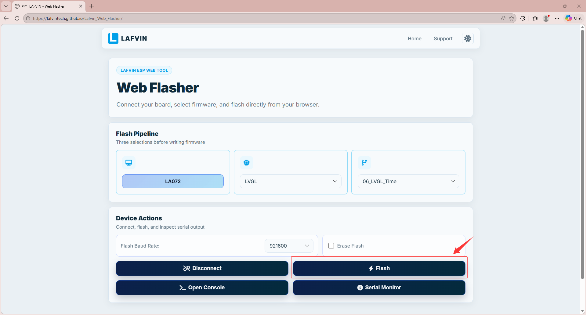

Flash The Firmware
===================

**The kit is shipped without firmware preloaded, so no response after power-up is normal. Follow the steps below to program the spider robot and make it move.**

**We provide two methods for flashing firmware; you can choose the method that suits you best.**

----

.. _Install Serial Port Tool:

Install Serial Port Tool
------------------------

This kit uses an ESP8266 board with a CP2102 USB-to-UART bridge. Ensure the CP2102 driver is installed on your computer before connecting the board, or the serial port will not be detected. Connect the board, press Win+X to open Device Manager, and verify the driver is installed. If not, use the link below to download and install it.

.. image:: _static/program/1.CP2102.png
   :width: 800
   :align: center

.. raw:: html

   

`Click here to access the official driver download page <https://www.silabs.com/software-and-tools/usb-to-uart-bridge-vcp-drivers?tab=downloads>`_

For detailed download and installation instructions, please watch the video below.

.. video:: _static/program/driver_ins.mp4
    :width: 100%

----

.. _Programming Program:

Method 1：Online Flash
----------------------

LAFVIN Web Flasher is provided by LAFVIN's fast online flashing tool, which has the firmware built-in. Simply select the corresponding kit for quick flashing.

----

A. Click here to open the LAFVIN ESP Web Tool: `LAFVIN ESP Web Tool <https://lafvintech.github.io/Lafvin_Web_Flasher/>`_

.. image:: _static/program/2.lafvin.png
   :width: 800
   :align: center

.. raw:: html

   

B. Select the corresponding program for burning according to the image below.

C. Click **CONNCE**, and in the pop-up window, select the corresponding port to connect.

.. image:: _static/program/4.lafvin.png
   :width: 800
   :align: center

.. raw:: html

   

D. Click **FLASH** to start the burning process.

.. raw:: html

   

E. Waiting for the burning process to complete.

.. image:: _static/program/6.lafvin.png
   :width: 800
   :align: center

.. raw:: html

   

F. After the program is burned, press the RST reset button on the development board and the system will start running.

----

.. attention::

 When programming, simply connect the data cable to the ESP8266 development board; there is no need to connect it to the expansion board or any servos or ultrasonic sensors to avoid programming failure.

 .. image:: _static/program/7.esp8266.png
   :width: 800
   :align: center

 .. raw:: html

   

----

.. note::
   
   If flashing fails, please check the following:

   - The USB cable and USB port are functional; try another cable or port.
   - The ESP8266 board is powered and enters download mode correctly.
   - The selected serial port is correct and not being used by other software.
   - The CP2102 driver is installed and recognized in Device Manager.
   - The firmware file is selected correctly and the flash settings match the board (baud rate, flash mode, etc.).

   If the issue persists, reboot your computer, restart the board, and retry.

----

Method 2：Flash Download Tool
-----------------------------

In addition to using online flashing, you can also use Espressif's official flashing tool to flash the firmware.

----

A. Download **Flash Download Tool** from the resource package we provide. After decompression, open the file, select "flash_download_tool_xxx.exe" and double-click to open the software.

 .. image:: _static/program/8.TOOL.png
   :width: 800
   :align: center

 .. raw:: html

   

B. Select **ESP8266** and **Develop** from the drop-down menus, then click **OK**.

 .. image:: _static/program/9.TOOL.png
   :width: 800
   :align: center

 .. raw:: html

   

C. Import the firmware following the steps shown in the image.

 .. image:: _static/program/10.TOOL.png
   :width: 800
   :align: center

 .. raw:: html

   

.. note::

  - Please download the firmware file provided in the resource package in advance.

  - The firmware file is stored in the resource package at the following path: Code & Library — Code — 0.Spiderbot —BIN —0.Spiderbot.bin

D. Set the parameters as shown in the picture: SPI SPEED select 80MHz, SPI MODE select DIO, COM select the serial port actually connected to the computer, and BAUD set to 921600.

 .. image:: _static/program/11.TOOL.png
   :width: 800
   :align: center

 .. raw:: html

   

E. After completing the above settings, click the START button and the system will automatically start burning the firmware. Please wait patiently for the burning to complete.

 .. image:: _static/program/12.TOOL.png
   :width: 800
   :align: center

 .. raw:: html

   

F. After the burning is completed, the interface will display the FINISH prompt. At this time, press the RST reset button on the ESP8266 development board and the system will start running.

 .. image:: _static/program/13.TOOL.png
   :width: 800
   :align: center

 .. raw:: html

   

----

.. note::

   If the flashing process fails, please follow these steps:

   - Confirm that the ESP32 development board is properly connected to the computer via a USB cable and that the CH340 driver is installed.
   - Check that COMx in the flashing tool is the actual serial port number.
   - Confirm that the firmware file is correctly placed in the BIN folder and check the box on the left.
   - Verify the flashing parameter settings: SPI SPEED = 80MHz, SPI MODE = DIO, BAUD = 921600.
   - Try changing the USB cable or USB port to eliminate communication issues.
   - If flashing still fails, restart the computer and development board and try again.

----
