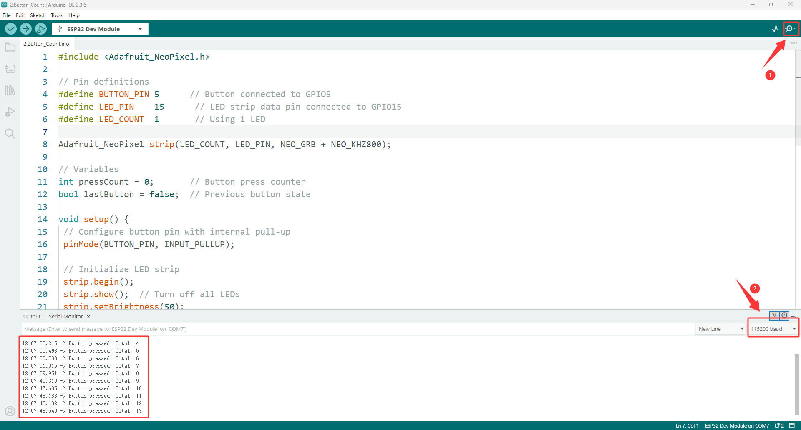
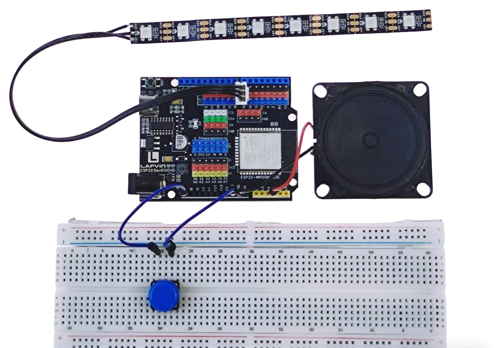
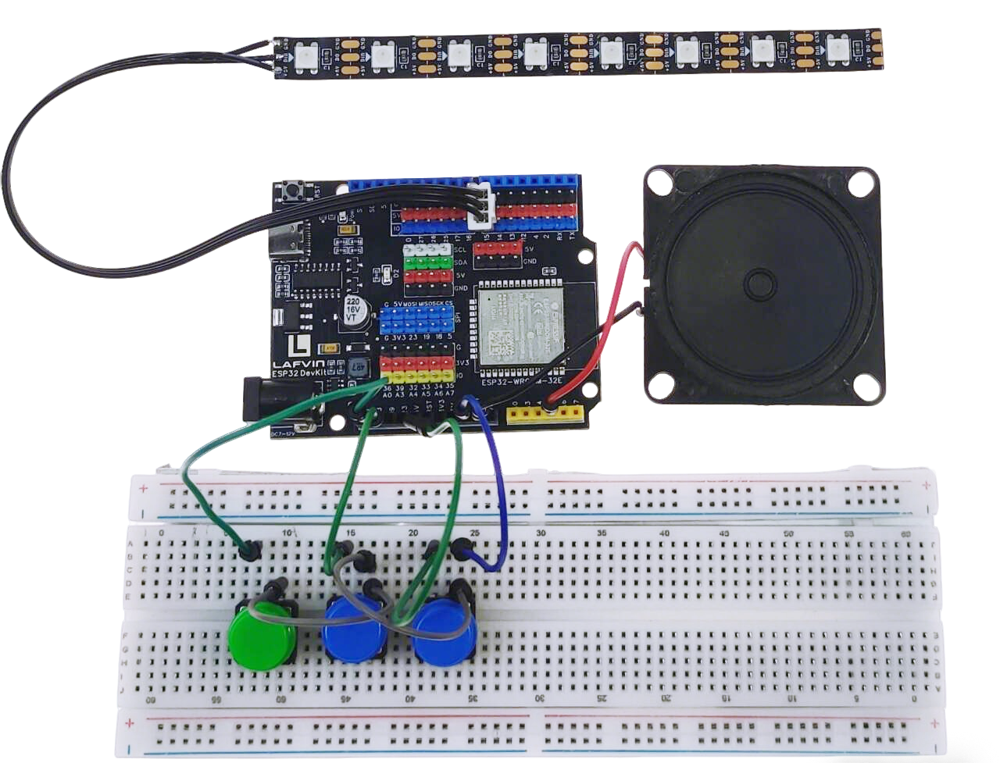
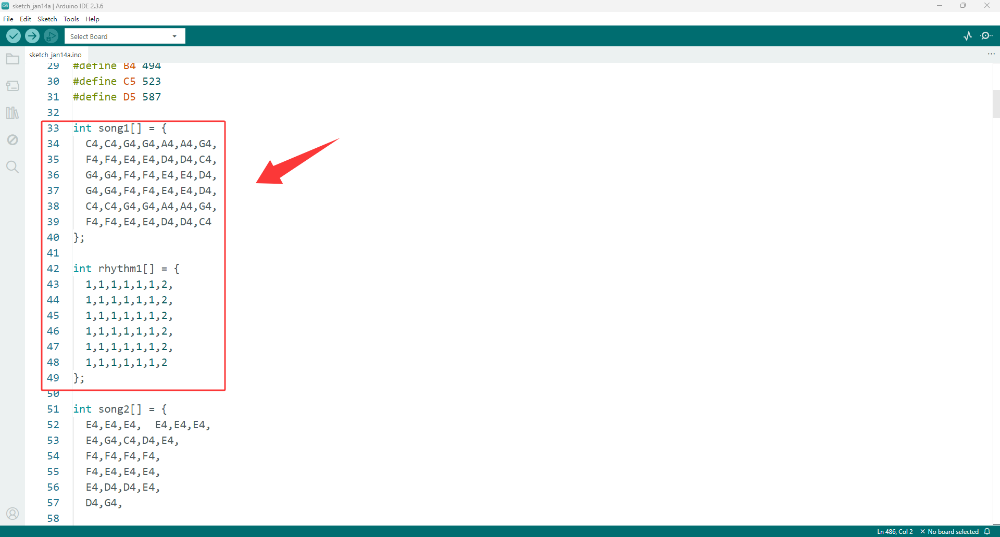

kit For Learning Course
======================

**In this section, we will use the components in this kit to expand our learning, gradually mastering the principles and functional characteristics of each component in order of depth, and completing the corresponding program writing.**

**The sixth code is the complete code for this kit "ESP32 DIY Electronic Piano," which you can click here to view.**

:ref:`ESP32 DIY Electronic Piano`

----

1. Breathing-Lamp
-----------------

Wiring diagram
~~~~~~~~~~~~~~

.. image:: _static/course/1.course.png
   :width: 800
   :align: center

.. raw:: html

   

- RGB —— ESP32 IO15

----

Example code
~~~~~~~~~~~~

.. code-block:: cpp

    #include <Adafruit_NeoPixel.h>

    #define LED_PIN    15      // Data pin connected to GPIO15
    #define LED_COUNT  1       // Using 1 LED only

 Adafruit_NeoPixel strip(LED_COUNT, LED_PIN, NEO_GRB + NEO_KHZ800);

 // Breathing effect variables
 int brightness = 0;    // Current brightness (0-255)
 int fadeAmount = 1;    // How much to change brightness each time
 int delayTime = 15;    // Delay between updates (ms)

 void setup() {
  strip.begin();
  strip.show();  // Initialize all pixels to 'off'
  strip.setBrightness(255);  // Set maximum brightness for strip
  
  Serial.begin(115200);
  Serial.println("RGB Breathing LED Test");
  Serial.println("LED should slowly breathe (fade in and out)");
 }

 void loop() {
  // Set LED color with current brightness (red color)
  strip.setPixelColor(0, brightness, 0, 0);
  strip.show();
  
  // Change brightness for next time
  brightness = brightness + fadeAmount;
  
  // Reverse direction at the ends of fade
  if (brightness <= 0 || brightness >= 255) {
    fadeAmount = -fadeAmount;
  }
  
  delay(delayTime);
 }

----

Achieved Effect
~~~~~~~~~~~~~~~~

 - The first LED in the RGB light is red, and it goes from bright to dim and then bright again, just like breathing.

----

2. Button_Count
-----------------

Wiring diagram
~~~~~~~~~~~~~~

.. image:: _static/course/6.course.png
   :width: 800
   :align: center

.. raw:: html

   

- RGB —— ESP32 IO15
- Button —— ESP32 IO5

----

Example code
~~~~~~~~~~~~

.. code-block:: cpp

 #include <Adafruit_NeoPixel.h>

 // Pin definitions
 #define BUTTON_PIN 5      // Button connected to GPIO13
 #define LED_PIN    15      // LED strip data pin connected to GPIO15
 #define LED_COUNT  1       // Using 1 LED

 Adafruit_NeoPixel strip(LED_COUNT, LED_PIN, NEO_GRB + NEO_KHZ800);

 // Variables
 int pressCount = 0;       // Button press counter
 bool lastButton = false;  // Previous button state

 void setup() {
  // Configure button pin with internal pull-up
  pinMode(BUTTON_PIN, INPUT_PULLUP);
  
  // Initialize LED strip
  strip.begin();
  strip.show();  // Turn off all LEDs
  strip.setBrightness(50);
  
  // Initialize serial communication
  Serial.begin(115200);
  Serial.println("Button Counter Started");
  Serial.println("Press button: LED turns RED, counter increases");
  Serial.println("Release button: LED turns OFF");
 }

 void loop() {
  // Read button state (LOW = pressed when using INPUT_PULLUP)
  bool buttonPressed = digitalRead(BUTTON_PIN) == LOW;
  
  // Control RGB LED
  if (buttonPressed) {
    strip.setPixelColor(0, strip.Color(255, 0, 0));  // Red when pressed
    strip.show();
  } else {
    strip.setPixelColor(0, strip.Color(0, 0, 0));    // Off when released
    strip.show();
  }
  
  // Detect button press (rising edge detection)
  if (buttonPressed && !lastButton) {
    pressCount++;  // Increment counter
    
    Serial.print("Button pressed! Total: ");
    Serial.println(pressCount);
  }
  
  // Save current state for next loop
  lastButton = buttonPressed;
  
  // Small delay for stability
  delay(50);
 }
----

Achieved Effect
~~~~~~~~~~~~~~~~

 - Press the button and the first LED of the RGB light will light up.
 - Open the serial monitor, which will record the number of times the button was pressed.

----

3. Rgb_Color_Lamp
-----------------

Wiring diagram
~~~~~~~~~~~~~~

.. image:: _static/course/6.course.png
   :width: 800
   :align: center

.. raw:: html

   

  
- RGB —— ESP32 IO15
- Button —— ESP32 IO5

----

Example code
~~~~~~~~~~~~

.. code-block:: cpp

 #include <Adafruit_NeoPixel.h>

 #define BUTTON_PIN 5
 #define LED_PIN    15
 #define LED_COUNT  8

 Adafruit_NeoPixel strip(LED_COUNT, LED_PIN, NEO_GRB + NEO_KHZ800);

 // Simple variables
 int mode = 0;           // 0=Off, 1=Red, 2=Green, 3=Blue, 4=Rainbow, 5=Wave
 int brightness = 100;
 bool lastButton = HIGH;
 unsigned long pressTime = 0;
 int animationStep = 0;

 void setup() {
  pinMode(BUTTON_PIN, INPUT_PULLUP);
  strip.begin();
  strip.setBrightness(brightness);
  Serial.begin(115200);
  Serial.println("8-LED Interactive Light Ready");
  updateAllLEDs();
 }

 void loop() {
  bool button = digitalRead(BUTTON_PIN);
  
  // Button pressed
  if (button == LOW && lastButton == HIGH) {
    pressTime = millis();
  }
  
  // Button released
  if (button == HIGH && lastButton == LOW) {
    unsigned long holdTime = millis() - pressTime;
    
    if (holdTime < 500) {
      // Short press: change mode
      mode = (mode + 1) % 6;
      if (mode == 0) mode = 1;  // Skip off mode when cycling
      Serial.print("Mode: ");
      Serial.println(mode);
      updateAllLEDs();
    } else {
      // Long press: change brightness
      brightness += 80;
      if (brightness > 255) brightness = 30;
      strip.setBrightness(brightness);
      Serial.print("Brightness: ");
      Serial.println(brightness);
      updateAllLEDs();
    }
  }
  
  lastButton = button;
  
  // Run animations for mode 4 and 5
  if (mode == 4 || mode == 5) {
    runSimpleAnimation();
  }
  
  delay(10);
 }

 void updateAllLEDs() {
  strip.clear();
  
  if (mode == 0) {
    // All off
    for (int i = 0; i < LED_COUNT; i++) {
      strip.setPixelColor(i, 0, 0, 0);
    }
  }
  else if (mode == 1) {
    // All red
    for (int i = 0; i < LED_COUNT; i++) {
      strip.setPixelColor(i, 255, 0, 0);
    }
  }
  else if (mode == 2) {
    // All green
    for (int i = 0; i < LED_COUNT; i++) {
      strip.setPixelColor(i, 0, 255, 0);
    }
  }
  else if (mode == 3) {
    // All blue
    for (int i = 0; i < LED_COUNT; i++) {
      strip.setPixelColor(i, 0, 0, 255);
    }
  }
  else if (mode == 4) {
    // Rainbow (will be animated)
    return;
  }
  else if (mode == 5) {
    // Chase effect (will be animated)
    return;
  }
  
  strip.show();
 }

 void runSimpleAnimation() {
  strip.clear();
  animationStep++;
  
  if (mode == 4) {
    // Rainbow animation
    for (int i = 0; i < LED_COUNT; i++) {
      int hue = (animationStep * 10 + i * 30) % 360;
      hue = hue * 65536L / 360;
      strip.setPixelColor(i, strip.gamma32(strip.ColorHSV(hue, 255, brightness)));
    }
  }
  else if (mode == 5) {
    // Chase animation
    for (int i = 0; i < LED_COUNT; i++) {
      if ((i + animationStep) % 3 == 0) {
        strip.setPixelColor(i, 255, 0, 0);
      } else if ((i + animationStep) % 3 == 1) {
        strip.setPixelColor(i, 0, 255, 0);
      } else {
        strip.setPixelColor(i, 0, 0, 255);
      }
    }
  }
  
  strip.show();
  delay(100);
 }
----

Achieved Effect
~~~~~~~~~~~~~~~~

 - Press the button, and the RGB lights will switch between different lighting effects.

----

4. Single ToneGenerator
-----------------------

Wiring diagram
~~~~~~~~~~~~~~

.. raw:: html

   

  

- RGB —— ESP32 IO15
- Button —— ESP32 IO5
- Speaker —— ESP32 IO33
----

Example code
~~~~~~~~~~~~

.. code-block:: cpp

 #include <Adafruit_NeoPixel.h>

 // Pin definitions
 #define BUTTON_PIN 5      // Button to change notes
 #define SPEAKER_PIN 33    // Speaker positive pin (negative to GND)
 #define LED_PIN    15     // LED for visual feedback

 #define LED_COUNT 1

 Adafruit_NeoPixel strip(LED_COUNT, LED_PIN, NEO_GRB + NEO_KHZ800);

 // Musical notes frequencies (Hz) - C Major Scale
 const int notes[] = {
  262,  // C4 - Do
  294,  // D4 - Re
  330,  // E4 - Mi
  349,  // F4 - Fa
  392,  // G4 - Sol
  440,  // A4 - La
  494   // B4 - Si
 };

 const char* noteNames[] = {
  "Do (C4)",
  "Re (D4)", 
  "Mi (E4)",
  "Fa (F4)",
  "Sol (G4)",
  "La (A4)",
  "Si (B4)"
 };

 // Colors for each note
 uint32_t noteColors[] = {
  strip.Color(255, 0, 0),     // Do - Red
  strip.Color(255, 128, 0),   // Re - Orange
  strip.Color(255, 255, 0),   // Mi - Yellow
  strip.Color(0, 255, 0),     // Fa - Green
  strip.Color(0, 128, 255),   // Sol - Light Blue
  strip.Color(0, 0, 255),     // La - Blue
  strip.Color(128, 0, 255)    // Si - Purple
 };

 // Variables
 int currentNote = 0;          // Current note index (0-6)
 bool lastButtonState = HIGH;
 unsigned long lastPressTime = 0;

 // Speaker setup
 #define SPEAKER_CHANNEL 0

 void setup() {
  Serial.begin(115200);
  
  // Setup button
  pinMode(BUTTON_PIN, INPUT_PULLUP);
  
  // Setup speaker with LEDC
  ledcSetup(SPEAKER_CHANNEL, 2000, 8);
  ledcAttachPin(SPEAKER_PIN, SPEAKER_CHANNEL);
  
  // Setup LED
  strip.begin();
  strip.show();
  strip.setBrightness(100);
  
  // Show current note
  updateDisplay();
  
  Serial.println("Tone Generator with Speaker");
  Serial.println("Short press: Change to next note");
  Serial.println("----------------------");
 }

 void loop() {
  bool buttonState = digitalRead(BUTTON_PIN);
  
  // Button pressed (detect falling edge)
  if (buttonState == LOW && lastButtonState == HIGH) {
    // Simple debounce
    delay(50);
    
    if (digitalRead(BUTTON_PIN) == LOW) {
      // Change to next note
      changeNote();
      
      // Play the new note briefly
      playNoteBriefly();
    }
  }
  
  lastButtonState = buttonState;
  delay(10);
 }

 void changeNote() {
  // Move to next note
  currentNote = (currentNote + 1) % 7;
  
  updateDisplay();
  
  // Visual feedback
  for (int i = 0; i < 2; i++) {
    strip.setPixelColor(0, strip.Color(255, 255, 255));
    strip.show();
    delay(50);
    strip.setPixelColor(0, noteColors[currentNote]);
    strip.show();
    delay(50);
  }
 }

 void playNoteBriefly() {
  Serial.print("Playing: ");
  Serial.print(noteNames[currentNote]);
  Serial.print(" (");
  Serial.print(notes[currentNote]);
  Serial.println(" Hz)");
  
  // Play note on speaker
  ledcWriteTone(SPEAKER_CHANNEL, notes[currentNote]);
  
  // Visual feedback - bright LED
  strip.setPixelColor(0, noteColors[currentNote]);
  strip.setBrightness(200);
  strip.show();
  
  // Play for 300ms
  delay(300);
  
  // Stop speaker
  ledcWriteTone(SPEAKER_CHANNEL, 0);
  
  // Dim LED back
  strip.setBrightness(100);
  strip.show();
 }

 void updateDisplay() {
  Serial.println("----------------------");
  Serial.print("Current note: ");
  Serial.println(noteNames[currentNote]);
  Serial.print("Frequency: ");
  Serial.print(notes[currentNote]);
  Serial.println(" Hz");
  Serial.println("----------------------");
  
  // Update LED color
  strip.setPixelColor(0, noteColors[currentNote]);
  strip.setBrightness(100);
  strip.show();
 }
----

Achieved Effect
~~~~~~~~~~~~~~~~

 - Press the button, and the speaker will play the Do-Si syllables in sequence and light up different colored lights.

----

5. Triple Bond Piano
--------------------

Wiring diagram
~~~~~~~~~~~~~~

.. raw:: html

   

- RGB —— ESP32 IO15
- Button1 —— ESP32 IO5
- Button2 —— ESP32 IO18
- Button3 —— ESP32 IO5
- Speaker —— ESP32 IO33

----

Example code
~~~~~~~~~~~~

.. code-block:: cpp

 #include <Adafruit_NeoPixel.h>

 #define BTN1 5   // Do
 #define BTN2 18   // Mi  
 #define BTN3 19   // Sol
 #define SPEAKER 33
 #define LED_PIN 15

 Adafruit_NeoPixel leds(3, LED_PIN, NEO_GRB + NEO_KHZ800);

 // Notes for C major scale
 int notes[] = {262, 294, 330, 349, 392, 440, 494};
 // Our buttons: Do(0), Mi(2), Sol(4)
 int buttonNotes[] = {0, 2, 4};  // Indexes in notes array

 // Chord definitions
 #define CHORD_C_MAJOR 0     // Do + Mi + Sol
 #define CHORD_F_MAJOR 1     // Fa + La + Do
 #define CHORD_G_MAJOR 2     // Sol + Si + Re

 int currentChord = -1;      // -1 = no chord
 bool buttons[3] = {false, false, false};
 unsigned long buttonTime[3] = {0, 0, 0};

 void setup() {
  Serial.begin(115200);
  
  pinMode(BTN1, INPUT_PULLUP);
  pinMode(BTN2, INPUT_PULLUP);
  pinMode(BTN3, INPUT_PULLUP);
  
  ledcSetup(0, 2000, 8);
  ledcAttachPin(SPEAKER, 0);
  
  leds.begin();
  leds.setBrightness(100);
  
  Serial.println("Chord Piano - Three Keys");
  Serial.println("Do+Mi = Interval");
  Serial.println("Do+Mi+Sol = C Major Chord");
  Serial.println("Mi+Sol = Another interval");
 }

 void loop() {
  // Read buttons with debounce
  readButton(0, BTN1);
  readButton(1, BTN2);
  readButton(2, BTN3);
  
  // Check what's being pressed
  int pressedCount = 0;
  for (int i = 0; i < 3; i++) {
    if (buttons[i]) pressedCount++;
  }
  
  // Play appropriate sound
  if (pressedCount == 0) {
    ledcWriteTone(0, 0);  // Stop sound
    currentChord = -1;
  }
  else if (pressedCount == 1) {
    // Single note
    for (int i = 0; i < 3; i++) {
      if (buttons[i]) {
        playSingleNote(i);
        break;
      }
    }
    currentChord = -1;
  }
  else {
    // Multiple buttons - check for chords
    checkChord();
  }
  
  // Update LEDs
  updateLEDs();
  
  delay(10);
 }  

 void readButton(int index, int pin) {
  bool state = digitalRead(pin);
  
  if (state == LOW && !buttons[index]) {
    // Button just pressed
    if (millis() - buttonTime[index] > 50) {  // Debounce
      buttons[index] = true;
      buttonTime[index] = millis();
      Serial.print("Button ");
      Serial.print(index + 1);
      Serial.println(" pressed");
    }
  }
  else if (state == HIGH && buttons[index]) {
    // Button just released
    buttons[index] = false;
    Serial.print("Button ");
    Serial.print(index + 1);
    Serial.println(" released");
  }
 }

 void playSingleNote(int buttonIndex) {
  int noteIndex = buttonNotes[buttonIndex];
  ledcWriteTone(0, notes[noteIndex]);
  
  // LED feedback
  for (int i = 0; i < 3; i++) {
    if (i == buttonIndex) {
      setLEDColor(i, true);
    } else {
      setLEDColor(i, false);
    }
  }
 }

 void checkChord() {
  // Check which buttons are pressed
  bool doPressed = buttons[0];  // Button 1
  bool miPressed = buttons[1];  // Button 2
  bool solPressed = buttons[2]; // Button 3
  
  // Check for C Major chord (Do + Mi + Sol)
  if (doPressed && miPressed && solPressed) {
    if (currentChord != CHORD_C_MAJOR) {
      currentChord = CHORD_C_MAJOR;
      Serial.println("C Major Chord!");
      playChord(CHORD_C_MAJOR);
    }
  }
  // Check for Do+Mi interval
  else if (doPressed && miPressed) {
    if (currentChord != 10) {  // Custom code for this interval
      currentChord = 10;
      Serial.println("Do-Mi Interval");
      // Play alternating between Do and Mi
      static bool alt = false;
      if (alt) {
        ledcWriteTone(0, notes[0]);  // Do
      } else {
        ledcWriteTone(0, notes[2]);  // Mi
      }
      alt = !alt;
    }
  }
  // Check for Mi+Sol interval
  else if (miPressed && solPressed) {
    if (currentChord != 11) {
      currentChord = 11;
      Serial.println("Mi-Sol Interval");
      // Play alternating
      static bool alt = false;
      if (alt) {
        ledcWriteTone(0, notes[2]);  // Mi
      } else {
        ledcWriteTone(0, notes[4]);  // Sol
      }
      alt = !alt;
    }
  }
  // Check for Do+Sol interval
  else if (doPressed && solPressed) {
    if (currentChord != 12) {
      currentChord = 12;
      Serial.println("Do-Sol Interval (Perfect 5th)");
      ledcWriteTone(0, notes[0]);  // Play Do (root)
    }
  }
 }

 void playChord(int chordType) {
  switch(chordType) {
    case CHORD_C_MAJOR:
      // Play C Major chord (Do, Mi, Sol)
      // We'll play the root note, but could also cycle through chord notes
      ledcWriteTone(0, notes[0]);  // Do
      
      // Chord animation on LEDs
      static unsigned long lastBlink = 0;
      if (millis() - lastBlink > 200) {
        lastBlink = millis();
        for (int i = 0; i < 3; i++) {
          leds.setPixelColor(i, 
            buttons[i] ? leds.Color(255, 255, 255) : leds.Color(0, 0, 0));
        }
        leds.show();
        delay(50);
        updateLEDs();
      }
      break;
  }
 }

 void setLEDColor(int index, bool pressed) {
  int colors[][3] = {{255,0,0}, {0,255,0}, {0,0,255}};
  
  if (pressed) {
    leds.setPixelColor(index, colors[index][0], colors[index][1], colors[index][2]);
  } else {
    leds.setPixelColor(index, 
      colors[index][0]/5, colors[index][1]/5, colors[index][2]/5);
  }
 }

 void updateLEDs() {
  for (int i = 0; i < 3; i++) {
    setLEDColor(i, buttons[i]);
  }
  leds.show();
 }

----

Achieved Effect
~~~~~~~~~~~~~~~~

 - The three buttons represent Do, Mi, and Sol, allowing you to use your imagination to play some simple music.

----

.. _ESP32 DIY Electronic Piano:

6. ESP32 DIY Electronic Piano
-----------------------------

Wiring diagram
~~~~~~~~~~~~~~

.. image:: _static/2.WIRING.png
   :width: 800
   :align: center

- RGB —— ESP32 IO15
- Button1 —— ESP32 IO5
- Button2 —— ESP32 IO18
- Button3 —— ESP32 IO19
- Button4 —— ESP32 IO23
- Button5 —— ESP32 IO32
- Button6 —— ESP32 IO33
- Button7 —— ESP32 IO12
- Button8 —— ESP32 IO4
- Speaker —— ESP32 IO13

----

Example code
~~~~~~~~~~~~

.. code-block:: cpp

  #include <FastLED.h>
  #include <WiFi.h>
  #include <WebServer.h>
  
  const char* ssid = "ESP32_Piano";
  const char* password = "12345678";
  
  WebServer server(80);
  
  #define BUZZER_PIN     13
  #define BUZZER_CHANNEL 0
  #define AUTO_KEY_PIN   4
  
  #define LED_PIN   15
  #define NUM_LEDS  8
  CRGB leds[NUM_LEDS];
  
  int keyPins[7] = {5, 18, 19, 23, 32, 33, 12};
  int noteFreq[7] = {262, 294, 330, 349, 392, 440, 494};
  
  uint8_t keyColors[7] = {0, 32, 64, 96, 128, 160, 192};
  
  #define C4 262
  #define D4 294
  #define E4 330
  #define F4 349
  #define G4 392
  #define A4 440
  #define B4 494
  #define C5 523
  #define D5 587
  
  int song1[] = {
    C4,C4,G4,G4,A4,A4,G4,
    F4,F4,E4,E4,D4,D4,C4,
    G4,G4,F4,F4,E4,E4,D4,
    G4,G4,F4,F4,E4,E4,D4,
    C4,C4,G4,G4,A4,A4,G4,
    F4,F4,E4,E4,D4,D4,C4
  };
  
  int rhythm1[] = {
    1,1,1,1,1,1,2,
    1,1,1,1,1,1,2,
    1,1,1,1,1,1,2,
    1,1,1,1,1,1,2,
    1,1,1,1,1,1,2,
    1,1,1,1,1,1,2
  };
  
  int song2[] = {
    E4,E4,E4,  E4,E4,E4,
    E4,G4,C4,D4,E4,
    F4,F4,F4,F4,
    F4,E4,E4,E4,
    E4,D4,D4,E4,
    D4,G4,
  
    E4,E4,E4,  E4,E4,E4,
    E4,G4,C4,D4,E4,
    F4,F4,F4,F4,
    F4,E4,E4,E4,
    G4,G4,F4,D4,C4
  };
  
  int rhythm2[] = {
    1,1,2, 1,1,2,
    1,1,1,1,2,
    1,1,1,1,
    1,1,1,1,
    1,1,1,1,
    2,2,
  
    1,1,2, 1,1,2,
    1,1,1,1,2,
    1,1,1,1,
    1,1,1,1,
    2,2,2,2,4
  };
  
  int song3[] = {
    C4,C4,D4,C4,F4,E4,
    C4,C4,D4,C4,G4,F4,
    C4,C4,C5,A4,F4,E4,D4,
    B4,B4,A4,F4,G4,F4
  };
  
  int rhythm3[] = {
    1,2,1,4,4,6,
    1,2,1,4,4,6,
    1,2,4,4,4,4,6,
    1,2,4,4,6,8
  };
  
  int* songs[]   = {song1, song2, song3};
  int* rhythms[] = {rhythm1, rhythm2, rhythm3};
  int songLen[] = {
    sizeof(song1)/sizeof(int),
    sizeof(song2)/sizeof(int),
    sizeof(song3)/sizeof(int)
  };
  
  int songIndex = -1;
  bool autoPlay = false;
  uint8_t timeHue = 0;
  
  #define BPM 120
  #define NOTE_TIME (60000 / BPM / 2)
  
  bool manualNotePlaying = false;
  unsigned long manualNoteOffTime = 0;
  
  bool webControlActive = false;
  int lastWebKey = -1;
  unsigned long lastWebKeyTime = 0;
  #define WEB_KEY_TIMEOUT 100
  
  void lightKeyLED(int keyIndex) {
    FastLED.clear();
  
    leds[keyIndex] = CHSV(keyColors[keyIndex], 255, 255);
  
    if (keyIndex > 0) {
      leds[keyIndex - 1] = CHSV(keyColors[keyIndex] + 20, 200, 100);
    }
    if (keyIndex < NUM_LEDS - 1) {
      leds[keyIndex + 1] = CHSV(keyColors[keyIndex] - 20, 200, 100);
    }
  
    FastLED.show();
  }
  
  uint8_t freqToHue(int freq) {
    freq = constrain(freq, 262, 587);
    return map(freq, 262, 587, 180, 0);
  }
  
  void colorBurst(uint8_t baseHue, uint8_t brightness) {
    for (int i = 0; i < NUM_LEDS; i++) {
      leds[i] = CHSV(baseHue + i * 18 + timeHue, 255, brightness);
    }
    timeHue += 6;
    FastLED.show();
  }
  
  void rainbowChase(uint8_t baseHue, int step) {
    fadeToBlackBy(leds, NUM_LEDS, 60);
    leds[step % NUM_LEDS] = CHSV(baseHue + timeHue, 255, 255);
    timeHue += 10;
    FastLED.show();
  }
  
  void rainbowBreath(uint8_t baseHue, uint8_t brightness) {
    for (int i = 0; i < NUM_LEDS; i++) {
      leds[i] = CHSV(baseHue + i * 12 + timeHue, 200, brightness);
    }
    timeHue += 3;
    FastLED.show();
  }
  
  void playNote(int noteIndex, bool fromWeb = false) {
    if (noteIndex >= 0 && noteIndex < 7) {
      ledcWriteTone(BUZZER_CHANNEL, noteFreq[noteIndex]);
      lightKeyLED(noteIndex);
      manualNoteOffTime = millis() + NOTE_TIME;
      manualNotePlaying = true;
      
      if (fromWeb) {
        webControlActive = true;
        lastWebKey = noteIndex;
        lastWebKeyTime = millis();
      }
    }
  }
  
  void startAutoPlay() {
    autoPlay = true;
    songIndex = (songIndex + 1) % 3;
    webControlActive = true;
  }
  
  const char* htmlContent = R"rawliteral(
  <!DOCTYPE html>
  <html lang="en">
  <head>
      <meta charset="UTF-8">
      <meta name="viewport" content="width=device-width, initial-scale=1.0">
      <title>ESP32 Piano</title>
      
  </head>
  <body>
      

          

              
1

              
Do

          

          

              
2

              
Re

          

          

              
3

              
Mi

          

          

              
4

              
Fa

          

          

              
5

              
Sol

          

          

              
6

              
La

          

          

              
7

              
Si

          

          

              
AUTO

          

      

  
      
  </body>
  </html>
  )rawliteral";
  
  void handleRoot() {
    server.send(200, "text/html", htmlContent);
  }
  
  void handlePlay() {
    if (server.hasArg("key")) {
      int keyIndex = server.arg("key").toInt();
      if (keyIndex >= 0 && keyIndex < 7) {
        playNote(keyIndex, true);
        server.send(200, "text/plain", "OK");
      }
    }
  }
  
  void handleAuto() {
    startAutoPlay();
    server.send(200, "text/plain", "OK");
  }
  
  void setup() {
    Serial.begin(115200);
    
    for (int i = 0; i < 7; i++) pinMode(keyPins[i], INPUT_PULLUP);
    pinMode(AUTO_KEY_PIN, INPUT_PULLUP);
  
    ledcSetup(BUZZER_CHANNEL, 2000, 8);
    ledcAttachPin(BUZZER_PIN, BUZZER_CHANNEL);
  
    FastLED.addLeds<WS2812, LED_PIN, GRB>(leds, NUM_LEDS);
    FastLED.setBrightness(200);
    FastLED.clear();
    FastLED.show();
  
    WiFi.softAP(ssid, password);
    Serial.println("AP Started");
    Serial.print("SSID: ");
    Serial.println(ssid);
    Serial.print("IP: ");
    Serial.println(WiFi.softAPIP());
  
    server.on("/", handleRoot);
    server.on("/play", handlePlay);
    server.on("/auto", handleAuto);
    
    server.begin();
    Serial.println("Web Server Started");
  }
  
  void loop() {
    server.handleClient();
    
    if (webControlActive && (millis() - lastWebKeyTime > WEB_KEY_TIMEOUT)) {
      if (millis() > manualNoteOffTime) {
        webControlActive = false;
      }
    }
  
    if (autoPlay && songIndex >= 0 && songIndex < 3) {
      static int noteIndex = 0;
      static unsigned long nextNoteTime = 0;
      
      if (millis() >= nextNoteTime) {
        if (noteIndex < songLen[songIndex]) {
          int freq = songs[songIndex][noteIndex];
          ledcWriteTone(BUZZER_CHANNEL, freq);
          
          uint8_t hue = freqToHue(freq);
          if (songIndex == 0) colorBurst(hue, 255);
          else if (songIndex == 1) rainbowChase(hue, noteIndex);
          else rainbowBreath(hue, 200);
          
          int delayTime = 220 * rhythms[songIndex][noteIndex];
          nextNoteTime = millis() + delayTime;
          noteIndex++;
        } else {
          noteIndex = 0;
          autoPlay = false;
          webControlActive = false;
          ledcWriteTone(BUZZER_CHANNEL, 0);
        }
      }
    }
    
    if (!webControlActive && !autoPlay) {
      if (manualNotePlaying && millis() > manualNoteOffTime) {
        ledcWriteTone(BUZZER_CHANNEL, 0);
        manualNotePlaying = false;
      }
      
      if (!manualNotePlaying) {
        for (int i = 0; i < 7; i++) {
          if (digitalRead(keyPins[i]) == LOW) {
            playNote(i, false);
            break;
          }
        }
      }
      
      if (digitalRead(AUTO_KEY_PIN) == LOW) {
        delay(20);
        if (digitalRead(AUTO_KEY_PIN) == LOW) {
          startAutoPlay();
          while (digitalRead(AUTO_KEY_PIN) == LOW);
        }
      }
    }
    
    if (!manualNotePlaying && !autoPlay) {
      fadeToBlackBy(leds, NUM_LEDS, 30);
      FastLED.show();
    }
    
    delay(5);
  }

----

Achieved Effect
~~~~~~~~~~~~~~~~

:ref:`Electronic Piano User Guide`

----

Extended code
~~~~~~~~~~~~

 - You can modify the code in the three autoplay tracks to change them to your preferred music.

 - For example, if you want to modify the first song, you only need to modify the two code snippets shown in the image to match the rhythm of the corresponding song.

.. raw:: html

   

- For example, to change the first song to "Ode to Joy", simply modify the original code as follows.

.. raw:: html

   

.. code-block:: cpp

  int song1[] = {
  E4,E4,F4,G4,G4,F4,E4,D4,
  C4,C4,D4,E4,E4,D4,D4,
  E4,E4,F4,G4,G4,F4,E4,D4,
  C4,C4,D4,E4,D4,C4,C4
 };

----

.. code-block:: cpp

  int rhythm1[] = {
  2,2,2,2,2,2,2,2,
  2,2,2,2,3,1,2,
  2,2,2,2,2,2,2,2,
  2,2,2,2,2,2,4
 };

----

.. note::

 - The number of notes must match the number of rhythms; otherwise, playback will fail.

 - Predefined pitch constants can be used: C4, D4, E4, F4, G4, A4, B4, C5, D5.

 - You can use your imagination to combine any tone to create your own music.

----