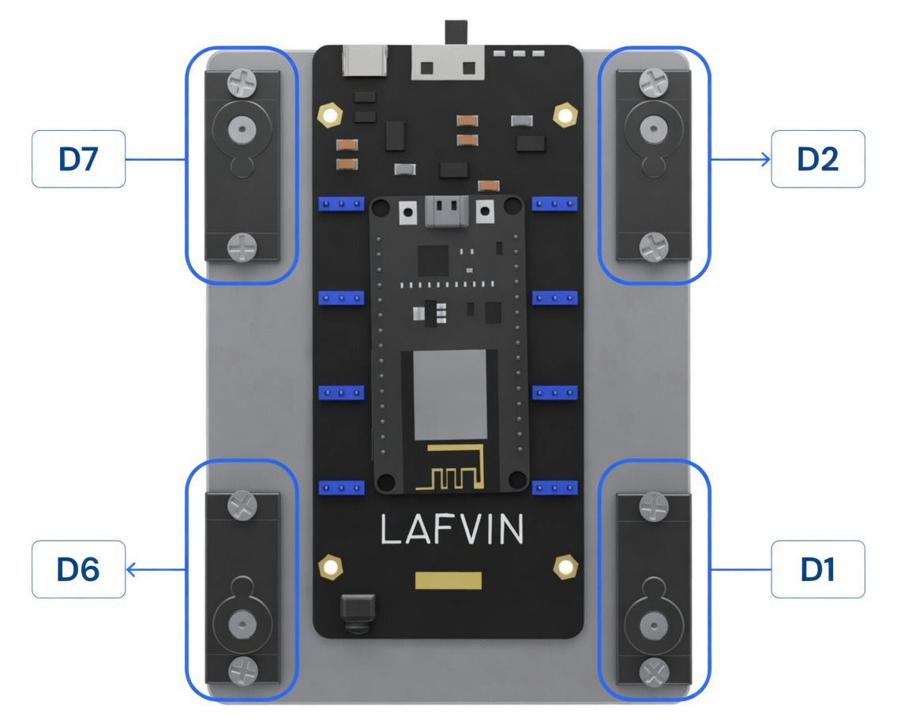
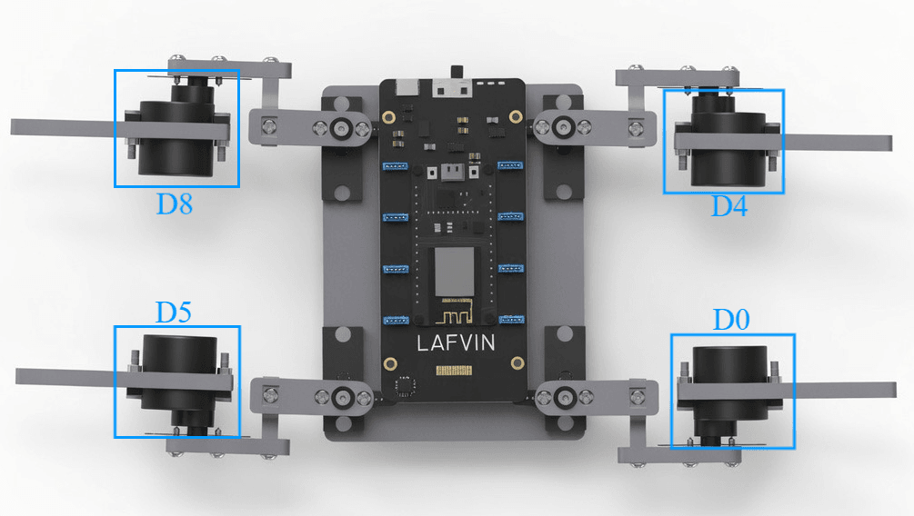
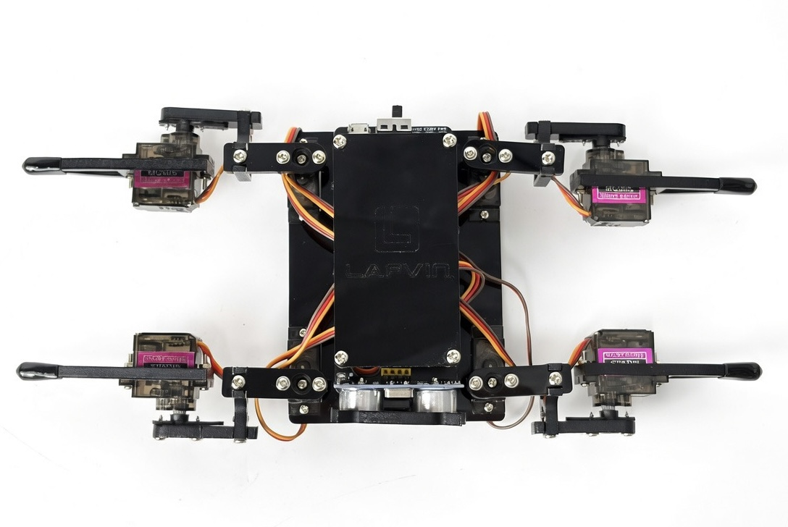

kit For Learning Course
======================

**In this section, we will use the components in this kit to expand our learning, gradually mastering the principles and functional characteristics of each component in order of depth, and completing the corresponding program writing.**

----

1. Make the servo motor turn
-----------------------------

Wiring diagram
~~~~~~~~~~~~~~

- MG90 Servo —— ESP8266 D4

----

Example code
~~~~~~~~~~~~

.. code-block:: cpp

 #include <Servo.h>

 Servo myservo;
 #define SERVO_PIN D4

 void setup() {
  myservo.attach(SERVO_PIN);
  myservo.write(0);
 }

 void loop() {
  myservo.write(180);
  delay(3000);
  
  myservo.write(0);
  delay(3000);
 }

----

Achieved Effect
~~~~~~~~~~~~~~~~

- Connect the servo motor to pin D4; the servo motor will rotate 180° every 3 seconds.

- You can use this program to sequentially switch between connecting 8 servos to test whether the servos are working properly.

.. raw:: html

   

.. image:: _static/course/1.1servo.gif
   :width: 800
   :align: center

----

Rotate two servo motors
------------------------

Wiring diagram
~~~~~~~~~~~~~~

- MG90 Servo —— ESP8266 D4

- MG90 Servo —— ESP8266 D8

----

Example code
~~~~~~~~~~~~

.. code-block:: cpp

 #include <Servo.h>

 Servo myservo1;  // Pin D4 SERVO
 Servo myservo2;  // Pin D8 SERVO
 
 #define SERVO_PIN1 D4
 #define SERVO_PIN2 D8

 void setup() {
  myservo1.attach(SERVO_PIN1);
  myservo2.attach(SERVO_PIN2);
  
  myservo1.write(0);
  myservo2.write(0);
 }

 void loop() {
  // Both servos rotate 180 degrees simultaneously

  myservo1.write(180);
  myservo2.write(180);
  delay(2000);
  
  // Both servos return to 0 degrees simultaneously

  myservo1.write(0);
  myservo2.write(0);
  delay(2000);
 }

----

Achieved Effect
~~~~~~~~~~~~~~~~

- Similar to the previous lesson, you only need to add one more servo and one more definition in the code to make both servos move simultaneously.

.. raw:: html

   

.. image:: _static/course/1.1servo.gif
   :width: 800
   :align: center

----

Let the spider move forward
----------------------------

In the previous two lessons, we've already gotten two servos moving. Next, we'll get all eight servos moving simultaneously to propel the spider forward.

----

Wiring diagram
~~~~~~~~~~~~~~

Please connect the wires as shown in the diagram below.

.. raw:: html

   

.. raw:: html

   

----

Example code
~~~~~~~~~~~~

.. code-block:: cpp

  #include <Servo.h>
  #include <Arduino.h>

  // Servo pin definitions
  const int SERVO_PINS[] = {14, 12, 13, 15, 16, 5, 4, 2};  // G14, G12, G13, G15, G16, G5, G4, G2
  const int ALLSERVOS = 8;
  const int ALLMATRIX = 9;  // 8 servos + time

  // Servo angle range
  const int SERVOMIN = 400;
  const int SERVOMAX = 2400;
  const int ANGLE_MIN = 1;
  const int ANGLE_MAX = 180;

  // Servo zero position
  const int Servo_Zero[] = { 135, 45, 135, 45, 45, 135, 45, 135, 500 };

  // Forward motion sequence
  const int Servo_Forward_Step = 11;
  const int Servo_Forward[][ALLMATRIX] = {
    // G14, G12, G13, G15, G16, G5,  G4,  G2,  ms
    {  70,  90,  90, 110, 110,  90,  90,  70, 200 }, // standby
    {  90,  90,  90, 110, 110,  90,  45,  90, 200 }, // leg1,4 lift up
    {  70,  90,  90, 110, 110,  90,  45,  70, 200 }, // leg1,4 put down
    {  70,  90,  90,  90,  90,  90,  45,  70, 200 }, // leg2,3 lift up
    {  70,  39, 141,  90,  90,  90,  90,  70, 200 }, // leg1,4 backward, leg2 forward
    {  70,  39, 141, 110, 110,  90,  90,  70, 200 }, // leg2,3 put down
    {  90,  90, 141, 110, 110,  90,  90,  90, 200 }, // leg1,4 lift up
    {  90,  90,  90, 110, 110, 135,  90,  90, 200 }, // leg2,3 backward
    {  70,  90,  90, 110, 110, 135,  90,  70, 200 }, // leg1,4 put down
    {  70,  90,  90, 110,  90, 135,  90,  70, 200 }, // leg3 lift up
    {  70,  90,  90, 110, 110,  90,  90,  70, 200 }, // leg3 put down forward
  };

  class SpiderBotMotion {
  public:
      Servo servos[8];
      
      // Initialize servos
      void init() {
          for (int i = 0; i < ALLSERVOS; i++) {
              servos[i].attach(SERVO_PINS[i], SERVOMIN, SERVOMAX);
          }
          delay(200);
      }
      
      // Move all servos to zero position
      void zero() {
          for (int i = 0; i < ALLSERVOS; i++) {
              int angle = constrain(Servo_Zero[i], ANGLE_MIN, ANGLE_MAX);
              servos[i].write(angle);
          }
          delay(Servo_Zero[8]);
      }
      
      // Forward motion
      void forward() {
          for (int step = 0; step < Servo_Forward_Step; step++) {
              for (int servo = 0; servo < ALLSERVOS; servo++) {
                  int angle = constrain(Servo_Forward[step][servo], ANGLE_MIN, ANGLE_MAX);
                  servos[servo].write(angle);
              }
              delay(Servo_Forward[step][8]);
          }
      }
      
      // Standby pose
      void standby() {
          int standby_angles[] = {60, 90, 90, 120, 120, 90, 90, 60};
          for (int i = 0; i < ALLSERVOS; i++) {
              int angle = constrain(standby_angles[i], ANGLE_MIN, ANGLE_MAX);
              servos[i].write(angle);
          }
          delay(500);
      }
  };

  SpiderBotMotion robot;

  void setup() {
      Serial.begin(9600);
      Serial.println("QuadBot Starting...");
      
      // 1. Initialize servos
      robot.init();
      
      // 2. Move servos to zero position on power-up
      Serial.println("Moving to zero position...");
      robot.zero();
      delay(500);
      
      // 3. Enter standby state
      Serial.println("Standby position...");
      robot.standby();
      delay(500);
      
      Serial.println("Ready! Robot will move forward.");
  }

  void loop() {
      // Execute forward motion repeatedly
      robot.forward();
      delay(100);
  }

----

Achieved Effect
~~~~~~~~~~~~~~~~

- The spider robot will now continuously perform forward movement.

.. raw:: html

   

.. raw:: html

   

- If the spider robot's forward movement is abnormal, ensure that the spider robot's initial installation position is as shown below, and click here to jump to the servo calibration page. :ref:`Servo calibration and debug`

- Since the code here only contains forward motion, the servo cannot be calibrated using the app; you only need to check the manual servo calibration section.

----

ESP8266 Rangefinder
-------------------

In this lesson, we will make full use of the built-in Wi-Fi function of the ESP8266 development board and combine it with an ultrasonic distance sensor to make a rangefinder.

----

Wiring diagram
~~~~~~~~~~~~~~

.. list-table::
   :header-rows: 1
   :widths: 50 50

   * - Ultrasonic Distance Sensor
     - Spider Robot Expansion Board
   * - VCC
     - 5V
   * - GND
     - GND
   * - TRIG
     - TX
   * - ECHO
     - RX

----

.. attention::

 Do not connect the ultrasonic distance sensor when programming the code, as this will cause a serial port conflict and prevent the code from being programmed.

----

Example code
~~~~~~~~~~~~

.. code-block:: cpp

  #include <ESP8266WiFi.h>
  #include <ESP8266WebServer.h>

  // WiFi hotspot configuration
  const char* ssid = "ESP8266-Distance-Meter";
  const char* password = "12345678";

  // Using RX/TX pins (GPIO1 and GPIO3)
  #define TRIG_PIN 1   // GPIO1 (TX pin)
  #define ECHO_PIN 3   // GPIO3 (RX pin)

  // Web server
  ESP8266WebServer server(80);

  // Distance variables
  float distance_cm = 0.0;
  unsigned long lastMeasurement = 0;
  const unsigned long MEASURE_INTERVAL = 100;
  bool measurementError = false;
  unsigned long measurementCount = 0;

  // Ultrasonic measurement function
  float measureDistance() {
    // Send trigger pulse
    digitalWrite(TRIG_PIN, LOW);
    delayMicroseconds(2);
    digitalWrite(TRIG_PIN, HIGH);
    delayMicroseconds(10);
    digitalWrite(TRIG_PIN, LOW);
    
    // Measure echo time
    unsigned long duration = pulseIn(ECHO_PIN, HIGH, 30000); // 30ms timeout
    
    if (duration == 0) {
      return -1.0;
    }
    
    // Calculate distance
    float distance = duration * 0.0343 / 2;
    
    // Valid range check
    if (distance > 400.0 || distance < 2.0) {
      return -1.0;
    }
    
    return distance;
  }

  // Clean HTML page - white background, black text, only distance
  const char* htmlPage = R"rawliteral(
  <!DOCTYPE html>
  <html lang="en">
  <head>
      <meta charset="UTF-8">
      <meta name="viewport" content="width=device-width, initial-scale=1.0">
      <title>Distance Meter</title>
      
  </head>
  <body>
      

          

              0.0cm
          

      

      
  </body>
  </html>
  )rawliteral";

  // Handle root path
  void handleRoot() {
    server.send(200, "text/html", htmlPage);
  }

  // Handle data request
  void handleData() {
    String json = "{";
    
    if (measurementError || distance_cm < 0) {
      json += "\"error\":\"Out of range\"";
      json += ",\"distance\":0";
    } else {
      json += "\"error\":null";
      json += ",\"distance\":" + String(distance_cm, 2);
    }
    
    json += ",\"count\":" + String(measurementCount);
    json += "}";
    
    server.send(200, "application/json", json);
  }

  // Handle not found
  void handleNotFound() {
    server.send(404, "text/plain", "404: Not Found");
  }

  void setup() {
    // Note: Serial.begin() not called to avoid RX/TX conflict
    
    // Initialize pins
    pinMode(TRIG_PIN, OUTPUT);
    pinMode(ECHO_PIN, INPUT);
    digitalWrite(TRIG_PIN, LOW);
    
    // Create WiFi hotspot
    WiFi.mode(WIFI_AP);
    
    // Configure AP parameters
    IPAddress local_ip(192, 168, 4, 1);
    IPAddress gateway(192, 168, 4, 1);
    IPAddress subnet(255, 255, 255, 0);
    
    WiFi.softAPConfig(local_ip, gateway, subnet);
    WiFi.softAP(ssid, password);
    
    // Setup web server
    server.on("/", handleRoot);
    server.on("/data", handleData);
    server.onNotFound(handleNotFound);
    
    server.begin();
  }

  void loop() {
    server.handleClient();
    
    // Periodic distance measurement
    unsigned long currentMillis = millis();
    if (currentMillis - lastMeasurement >= MEASURE_INTERVAL) {
      float measuredDistance = measureDistance();
      
      if (measuredDistance > 0) {
        distance_cm = measuredDistance;
        measurementError = false;
        measurementCount++;
      } else {
        measurementError = true;
      }
      
      lastMeasurement = currentMillis;
    }
    
    delay(10);
  }

----

Achieved Effect
~~~~~~~~~~~~~~~~

.. video:: _static/course/5.wifi.mp4
    :width: 60%

- After the code is successfully burned, connect the ultrasonic distance sensor to the expansion board and press the "RST" button on the ESP8266.

- Turn on your phone's Wi-Fi, find and connect to a Wi-Fi network named: **ESP8266-Distance-Meter** with the password: **12345678**.

- After successfully connecting to Wi-Fi, open any browser on your phone and enter the IP address: 192.168.4.1 to access the distance measurement display page.

----